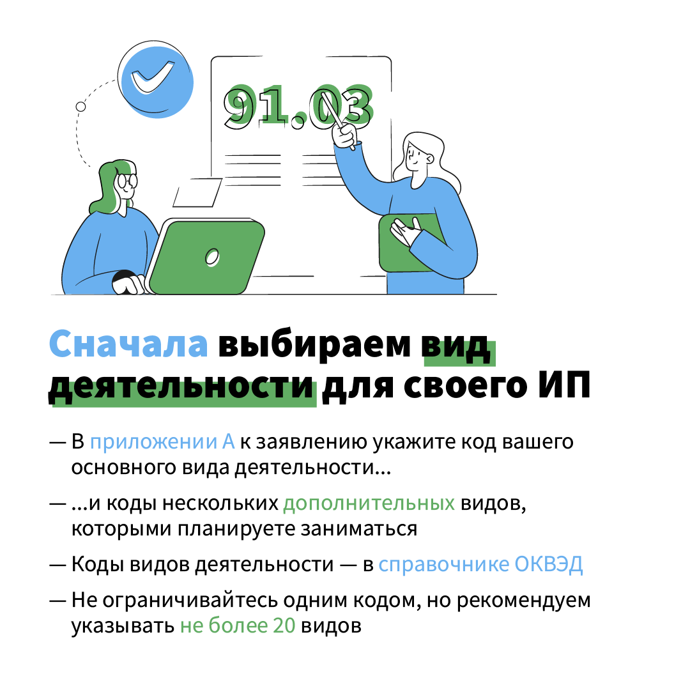
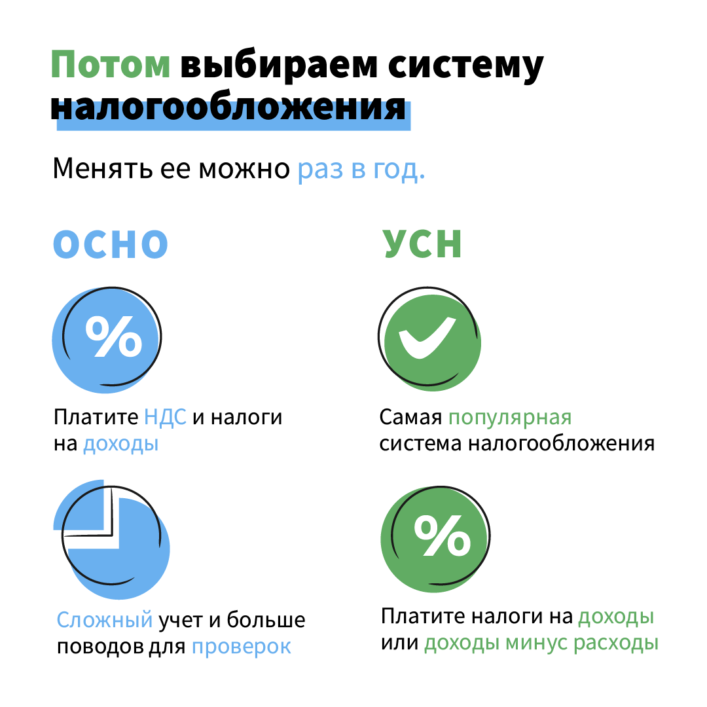
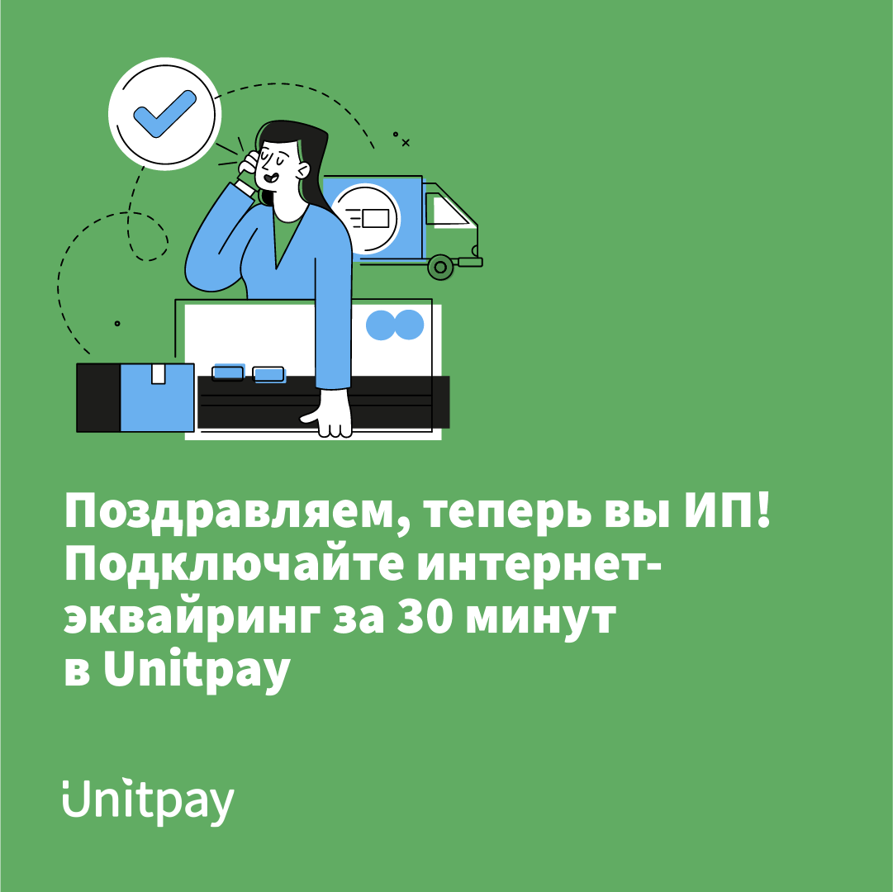

# Как перейти на ИП с физического лица

## Регистрация ИП в 2021 году: пошаговая инструкция от Unitpay

Многим кажется, что оформление **ИП** — долгая и сложная процедура с ворохом бумаг и бюрократией. Спойлер: это не так. Как открыть **ИП** в 2021 году — подробно ниже в нашем обзоре.


### Заполняем форму Р21001 


Подготовьте заявление **Р21001** в соответствии с требованиями **ФНС**. Данное заявление можно скачать на сайте налоговой. Для вашего удобства прикрепляем ссылку на [заявление](https://www.nalog.gov.ru/rn77/related_activities/registration_ip_yl/registration_ip/order/4162994/)


### Выбираем вид деятельности вашего ИП 


В приложении А укажите основной код вида деятельности и несколько дополнительных, которыми планирует заняться **ИП**. При выборе кодов необходимо руководствоваться[ **Общероссийским классификатором видов экономической деятельности ОК 029-2014 \(КДЕС Ред.2\)**](http://www.consultant.ru/document/cons_doc_LAW_163320/). Для начала нужно выбрать раздел классификатора, который соответствует вашей идее, затем нужно выбрать класс, подкласс и группу. Выбирайте только те коды **ОКВЭД** , которыми **ИП** будет заниматься в ближайшее время. Если вы выбираете несколько кодов, то один из них необходимо указать, как основной, а остальные будут дополнительными. У налоговой нет ограничений на максимальное кол-во кодов, лучше всего выбирать не больше 20. Вы можете использовать не все **ОКВЭДы** указанные при регистрации ИП. Наоборот, налоговая может взыскать с вас штраф от 5 000  до 10 000 рублей, когда вы ведёте бизнес и не указали его **ОКВЭД**. После регистрации в качестве **ИП** можно будет добавить или убрать лишние.


### Выбираем систему налогообложения 


Есть система налогообложения, которая применяется по умолчанию. Эту систему сокращенно называют **ОСНО — общая система налогообложения**. ****При данной системе налогообложения ИП должен платить налог на доходы и НДС, почти как фирма. На этой системе сложнее учет и больше поводов для проверок. Кроме **ОСНО** есть спецрежимы. Самый распространенный - это **УСН \(упрощенная система налогообложения\)**. Вы можете выбрать на этом спецрежиме один из двух объектов налогообложения - **«доход»** или **«доходы минус расходы»**. Нужно заранее понять, что выгоднее для конкретного вида деятельности. Налоговой базой при УСН с объектом «**доходы**» является денежное выражение всех доходов предпринимателя. При выборе объекта налогообложения "доходы" ставка будет составлять **6%**. На **УСН** с объектом «**доходы минус расходы**» базой является разница доходов и расходов. Чем больше расходов, тем меньше будет размер базы и, соответственно, суммы налога. Если объектом налогообложения являются «доходы минус расходы», ставка составляет **15%**.

 Помимо **УСН** есть еще 2 спецрежима - это **ПСН \(патентная система налогообложения\)** и **ЕСХН \(единый сельскохозяйственный налог\)**. Налоговая декларация на **ПСН** не сдается, а расчет налога производится сразу при оплате патента. Суть этого льготного налогового режима заключается в получении специального документа - патента, который дает право на осуществление определенной деятельности**.**  Налоговая ставка на патентной системе налогообложения равна 6%, а налоговой базой, с которой рассчитывают стоимость патента, является **потенциально возможный годовой доход \(ПВГД\)**. **ЕСХН** - – это налоговый режим, созданный специально для предпринимателей и организаций, которые занимаются производством сельскохозяйственной продукции. Раньше ставка налога была фиксированной, но с 2019 года каждый регион может устанавливать свою. Максимально — 6%.


### **Подаем необходимые документы в регистрирующий налоговый орган** 


 В первую очередь вам необходимо оплатить **госпошлину** в размере 800 рублей и отнести их лично в налоговую, либо отправить почтой, учтите, что перед отправкой документов, вам нужно будет каждый из них заверить у нотариуса. Если вы хотите подать документы онлайн, через сайт **ФHC**, то вам потребуется **электронная подпись**, если ее нет, то нужно ее сделать предварительно. Если вы отправляете документы онлайн, то госпошлину оплачивать не нужно. После чего вы подаете документы через сайт **ФНC**. Вы так же можете зарегистрировать **ИП** через доверенное лицо, тогда заявление **Р21001** и копию своего паспорта вы должны заверить через нотариуса.


### **Ждем ответное письмо** 


Через три рабочих дня вы получите письмо на электронный ящик, указанный в форме **Р21001**, лист записи **ЕГРИП \(единый государственный реестр индивидуальных предпринимателей\)**. Это будет выписка из единого реестра — **ЕГРИП**. Отказать в регистрации могут только по какому-то из оснований, указанных в законе. Например, если неправильно заполнены документы. Иногда достаточно исправить ошибку и подать их заново. После официальной регистрации можно на законных основаниях вести предпринимательскую деятельность: заключать договоры, открывать расчетные счета, нанимать сотрудников.


### Еще один способ открыть ИП 


Многие банки предлагают сделать это за вас удаленно без похода в **ФНС**, пошлин и нотариуса. От вас требуется только **СНИЛС** и **паспорт**. Для вас подготовят документы и сами их отправят в налоговую.


### Как быстро начать продавать свои услуги или товары? 


Начать продавать услуги или товары уже после регистрации своего **ИП** вам поможет **Unitpay**. Мы поможем вам с быстрым стартом, который займет у вас не более 30 минут, предоставим готовые модули формы оплаты для самых популярных **CMS**-систем, а если у вас нет собственной **онлайн-кассы**, вы можете воспользоваться ****[**Юнит.Чеками**](https://unitpay.ru/ru/receipts).

## **ИП - это просто, а ИП с Unitpay - еще проще!**

[Оригинальная статья](https://zen.yandex.ru/media/id/5f3b9e90b784f87663f36df3/registraciia-ip-v-2021-godu-poshagovaia-instrukciia-ot-unitpay-611f756b31399a4b751fb065) - в нашем Яндекс.Дзене.  
[Подписывайтесь](https://zen.yandex.ru/id/5f3b9e90b784f87663f36df3), чтобы не пропустить новые публикации!

