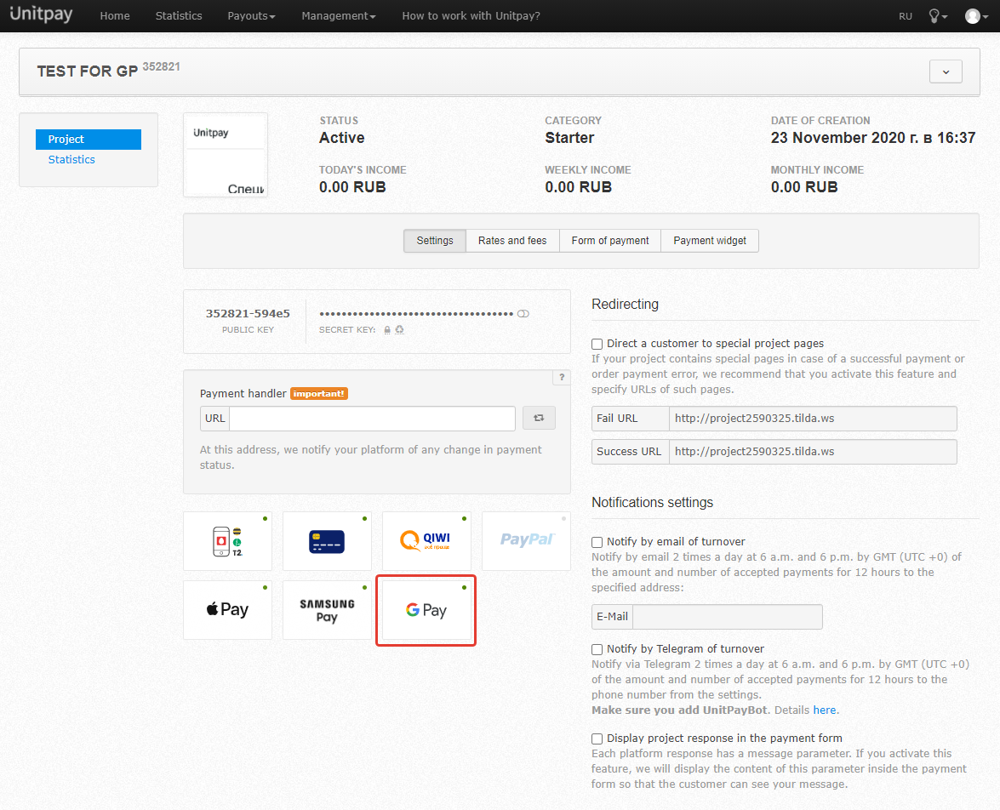

# Google Pay

\[ _We are working on the ability to use **Google Pay** now. Estimated release date - December 2020_ \]. 

**Google Pay** is a fast and simple payment method that allows you to make card payments without entering card details for each payment. The card data is safely stored by **Google**. This payment method is available for all devices \(mobile phones and computers\), regardless of the operating system and web browser.

Unitpay gives you a way to easily add it on your checkout page, making it more convenient for your clients to pay on your website.

As a merchant, you can use **Google Pay** via **Unitpay** checkout page.

**Google Pay** will be available for you after integration. 

[Here ](https://help.unitpay.ru/first_steps)you can read about first steps of integration \(registration, adding a project\). 

[Here ](https://help.unitpay.ru/payments)you can read about work with payments.

You can check the availability of accepting payments via **Google Pay** on the settings page of your project in **Unitpay**. As shown in the picture below:

The payer will see a page with the name of product, prices and **Google pay** button:

 

