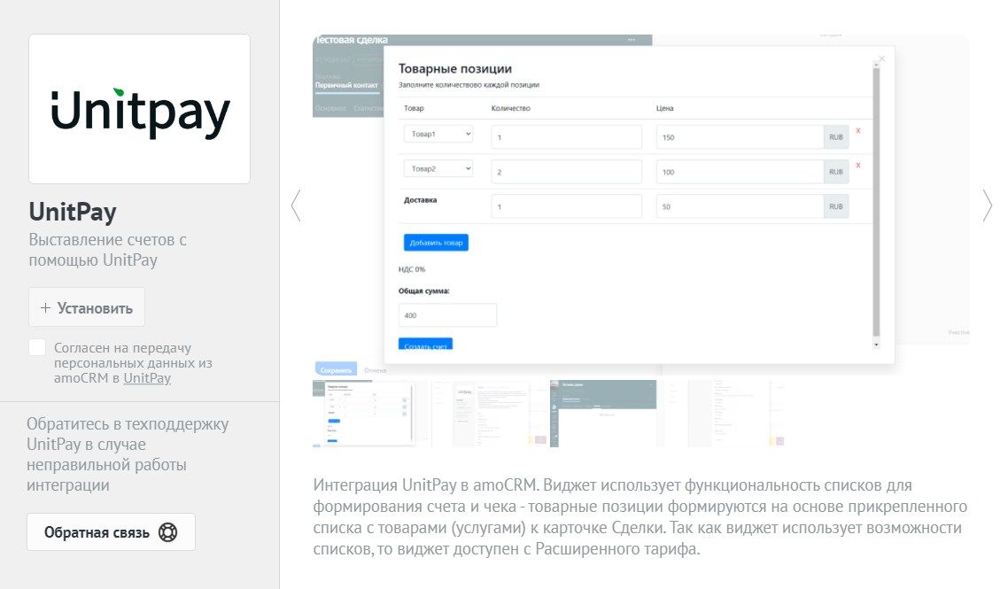
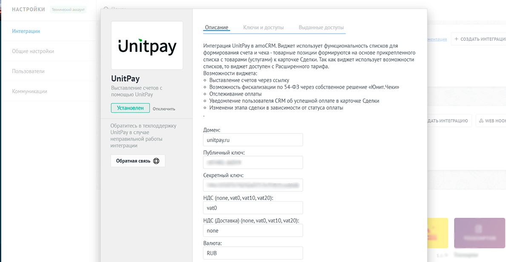
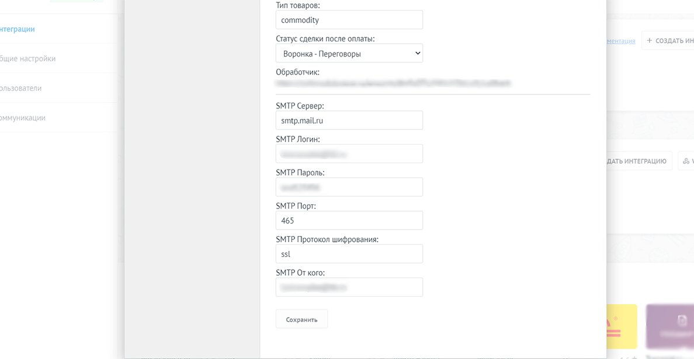
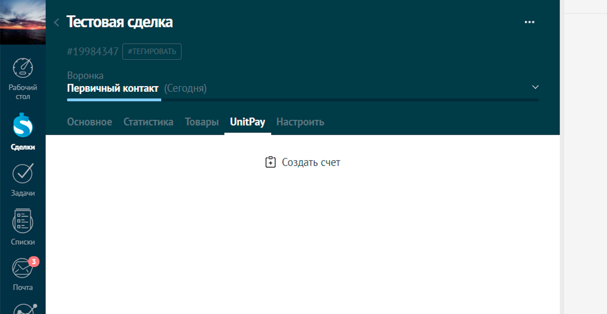
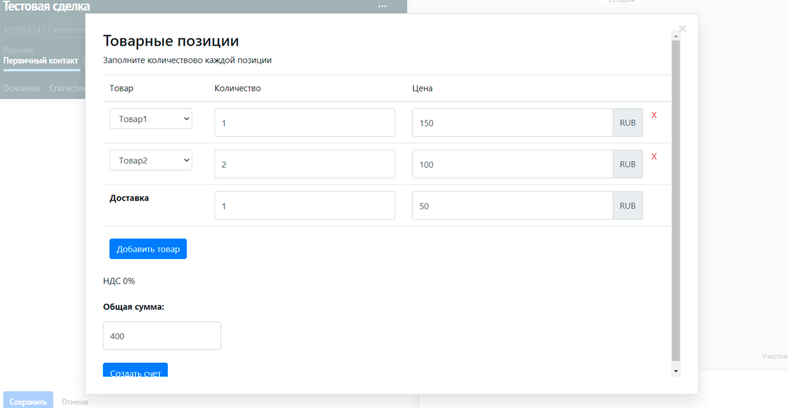

# AmoCRM

### Инструкция по настройке и установке модуля.

1.Во вкладке "Настройки" перейдите в "Интеграции". В строке поиска введите "Unitpay". Установите виджет.

Модуль использует функциональность **Списков**, которые доступны с Расширенного тарифа в AmoCRM.

2. Добавьте: домен \(unitpay.ru\), Public Key, Secret Key \(их можно взять в настройках проекта в личном кабинете Unitpay\). Если у вас подключены "Юнит.Чеки", то задайте НДС и "Тип товаров" \([подробнее о параметрах в чеках](https://help.unitpay.ru/online-cash-register/receipt_parameters)\).

3. Если вы хотите отправлять ссылку на оплату на email из Сделки, то вам нужно добавить настройки smtp.

4. Скопируйте "Обработчик" из настроек модуля и установите его в настройках проекта в личном кабинете Unitpay.

5. Включите функционал Товаров в AmoCRM \([как это сделать](https://www.amocrm.ru/support/lists/products)\). Задайте товары.

6. Перейдите в сделку на вкладку Unitpay. Добавьте счет. 

7. Выберите нужные товары и их количество. Если вам не нужна доставка, то оставьте "0" в стоимости доставки \(она не будет учитываться\).

8. После создания счет отобразится в Сделке, а также ссылка на оплату уйдет на первую почту партнера \(если вы настроили smtp\). 

9. Успешная оплата отобразится в сделке. Также вы можете настроить смену этапов воронки после успешной оплаты \(делается это в настройках модуля\).

