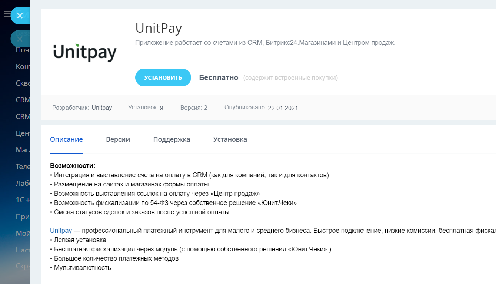
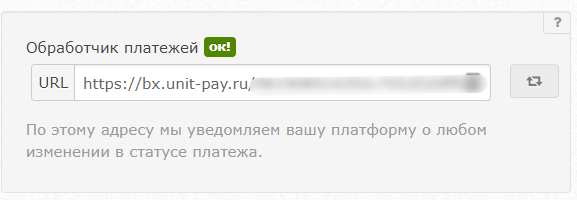
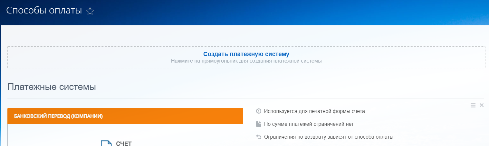
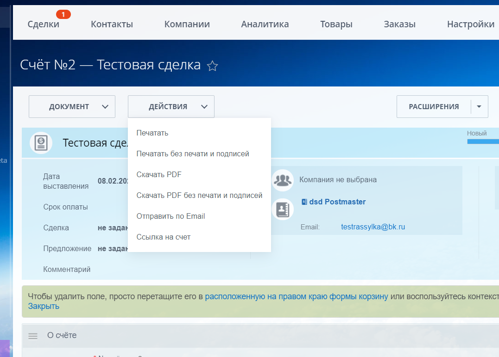
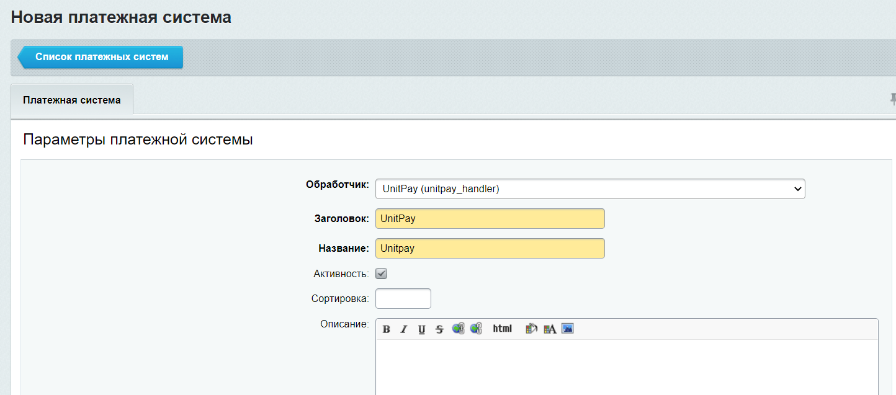

# Bitrix24

### Инструкция по настройке и установке модуля.


Ссылка на маркетплейс [https://www.bitrix24.ru/apps/?app=unitpay.unitpay](https://www.bitrix24.ru/apps/?app=unitpay.unitpay)


**Возможности: **

* Интеграция и выставление счета на оплату в CRM (как для компаний, так и для контактов)
* Размещение на сайтах и магазинах формы оплаты&#x20;
* Возможность выставления ссылок на оплату через «Центр продаж»&#x20;
* Возможность фискализации по 54-ФЗ через собственное решение «Юнит.Чеки»&#x20;
* Смена статусов сделок и заказов после успешной оплаты

**Установка:**

1.Установите приложение Unitpay (раздел "Приложения" -> в поиске наберите Unitpay -> Установить)

2\. Добавьте: домен (unitpay.ru), Public Key, Secret Key (их можно взять в настройках проекта в личном кабинете Unitpay). Если у вас подключены "Юнит.Чеки", то задайте НДС, НДС доставки и "Тип позиции" (подробнее о [параметрах в чеках](https://help.unitpay.ru/online-cash-register/receipt\_parameters)).

3\. Скопируйте и добавьте обработчик в настройки вашего проекта в личном кабинете Unitpay.

4\. Для добавления платежной системы в **CRM **перейдите CRM** **-> Настройки -> Способы оплаты -> Создать платежную систему

5\. Установите название (например, Unitpay). Задайте обработчик из списка UnitPay (unitpay\_handler). Проверьте, чтобы стоял флаг активности. Задайте тип клиента - контакт или компания, в зависимости от того с кем будете работать. Можно добавить 2 модуля Unitpay и для каждого выбрать свой тип.

.png>)

6\. Для выставления счета в CRM перейдите в Сделку -> Счета -> Выставить счет -> Действия -> Выставить счет

Счет может быть выставлен в ссылке/email/sms или другим способом (если вы подключите «Центр продаж»).

7\. Для добавления платежной системы в **Магазин **перейдите Магазин -> Еще -> Настройки -> Платежные системы -> Добавить платежную систему


При повторной генерации ссылки на оплату **для одной и той же сделки** сумма первоначального заказа не меняется, но CRM меняет состав корзины ==> при переходе на оплату получим ошибку 400.

Для корректного закрытия сделок рекомендуется использовать **первоначальную** ссылку на оплату (или создавать сделку заново).

