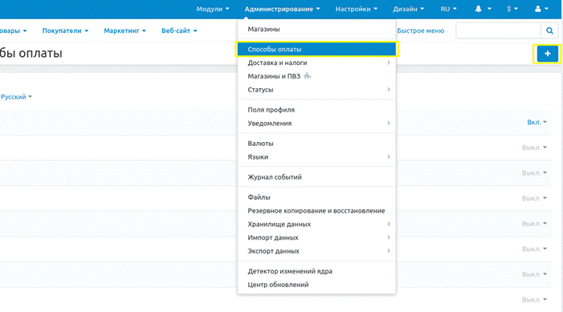
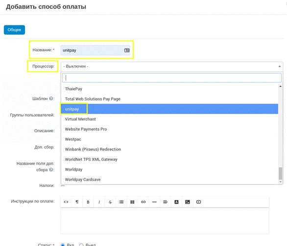

# CS-Cart

**The Module Setup and Installation Instruction**


This addon can also be downloaded from the [CS-Cart marketplace](https://marketplace.cs-cart.com/priem-oplaty-cherez-unitpay.html) from Attachments.


1. Download the [archive](https://github.com/unitpay/cscart-module/releases/tag/3.0.0) with the module.\

2. Copy the contents of the "**unitpay-addon**" folder from the archive to the root of your site.\

3. Go to the administrative panel under "**Modules → Module Management**", find the "**unitpay**" module and install it by clicking on the "**Install**" button. Wait for the installation.\

4. Go to "**Administration → Payment Methods**" and press the "**+**" button.

5\. In the first field "**Name**" enter any name of your choice. In the second field "**Processor**" find and select "**unitpay**".

6\. An additional “**Configure **" tab will appear. Enter data from your project in Unitpay in the appropriate fields.

7\. Then click the "**Create**" button.

8\. In your unitpay dashboard, enter the path to the payment processor using the template: \
[https://ваш.сайт/unitpay\_callback](https://xn--80ad1e.xn--80aswg/unitpay\_callback)&#x20;

