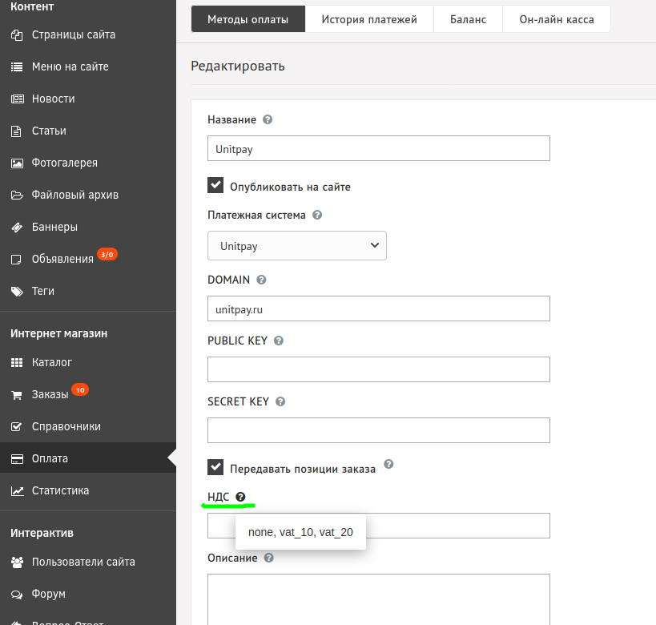

# DIAFAN.CMS

### Инструкция по настройке и установке модуля.


Модуль также можно скачать напрямую из [маркетплейса DIAFAN.CMS](https://addons.diafan.ru/modules/platezhi/priem-oplaty-cherez-unitpay647/).


1\. Скачайте [архив](https://github.com/unitpay/diafan-module/archive/master.zip) с модулем.

2\. Скопируйте содержимое директории "unitpay" из архива в корень вашего сайта.

3\. Перейдите в "Оплата"->"Методы оплаты" и добавьте новый метод оплаты, при выборе платежной системы укажите "Unitpay".

4\. Введите DOMAIN (unitpay.ru), PUBLIC KEY и SECRET KEY, которые вы можете взять в личном кабинете Unitpay.ru.

5\. В личном кабинете Unitpay.ru введите адрес обработчика платежей  [http://](http://diafan.app/payment/get/unitpay)<адрес вашего сайта>[/payment/get/unitpay](http://diafan.app/payment/get/unitpay)


НДС выставляется внутри настроек модуля в поле "НДС": none (без НДС), vat0 (НДС 0%), vat10 (НДС 10%), vat20 (НДС 20%)


