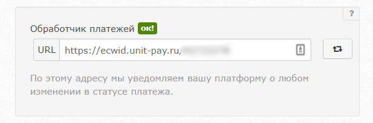

# Ecwid

### Инструкция по настройке и установке модуля.

1.Найдите приложение Unitpay в списке "Приложений" Ecwid. Нажмите "Установить".

2. Откройте установленное приложение и добавьте настройки вашего проекта \(Личный кабинет Unitpay -&gt; Настройки проекта\).  
- Добавьте домен: unitpay.ru  
- Public Key \(публичный ключ проекта\)  
- Secret Key \(секретный ключ проекта\)  
- [Тип позиции](https://help.unitpay.ru/online-cash-register/receipt_parameters) \(требуется для формирования чеков, по умолчанию передается commodity\)

3. После добавления настроек и сохранения появятся ссылка на "Обработчик платежей". Скопируйте его и добавьте в настройки проекта в личном кабинете Unitpay.

4. Далее нужно проверить, чтобы модуль был включен. Для это перейдите в  
_Оплата -&gt; Unitpay -&gt; Редактировать_


Официальное подробное руководство по модулю Unitpay от Ecwid можно прочесть [тут](https://support.ecwid.com/hc/ru/articles/4405021166226).


