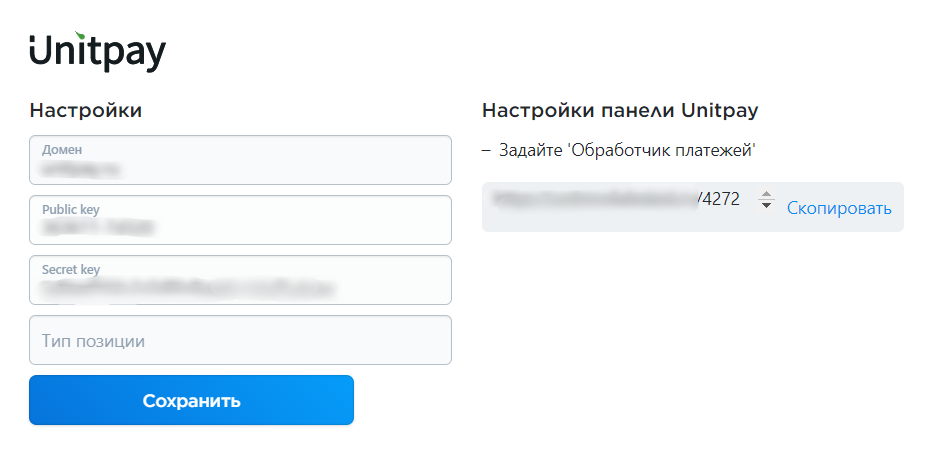

# Ecwid

### Инструкция по настройке и установке модуля.


Приложение работает в тестовом режиме. В ближайшее время оно появится в "Магазине приложений" Ecwid.


1.Установите приложение по прямой ссылке [https://my.ecwid.com/cp/\#apps:view=app&name=unitpay-dev](https://my.ecwid.com/cp/#apps:view=app&name=unitpay-dev)

2. Добавьте: домен \(unitpay.ru \), Public Key, Secret Key \(их можно взять в настройках проекта в личном кабинете Unitpay\)

Если вы работаете как юр.лицо и хотите пробивать "Юнит.Чеки", то можно задать определенный "Тип позиции" \([подробнее тут](https://help.unitpay.ru/online-cash-register/receipt_parameters)\). По умолчанию передается _"commodity" \(товар\)_

3. В личном кабинете Unitpay установите "Обработчик платежей" \(_**примечание:** тк приложение в тестовом режиме, то пока задать обработчик можно через наш суппорт manager@unitpay.ru или в онлайн-чате на сайте Unitpay_\)

4. Далее нужно проверить, чтобы модуль был включен. Для это перейдите в  
_Оплата -&gt; Unitpay -&gt; Редактировать_

5. Налоги настраиваются в разделе: _Настройки -&gt; Налоги -&gt; Настроить ставки_

