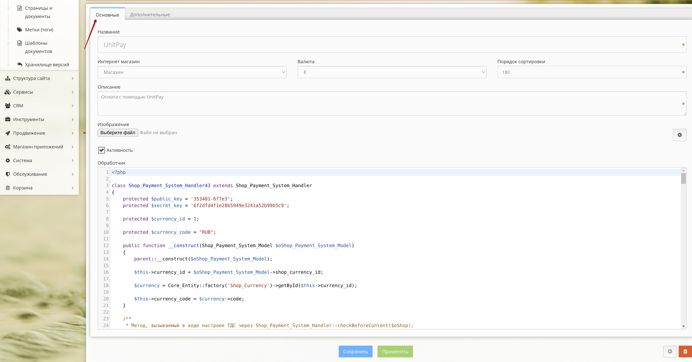
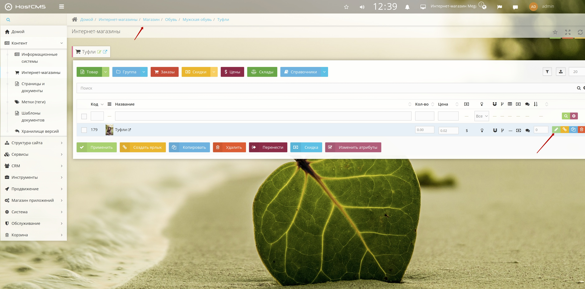
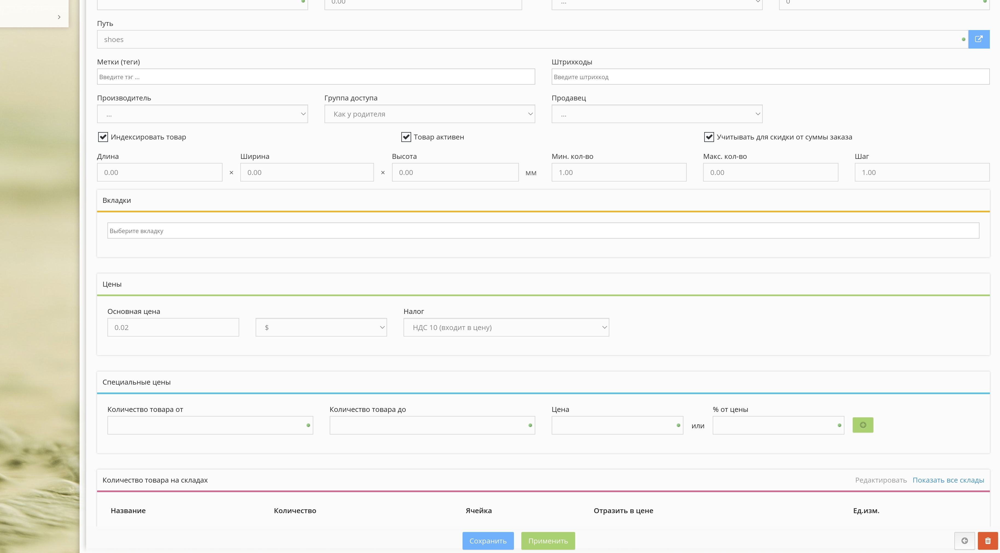
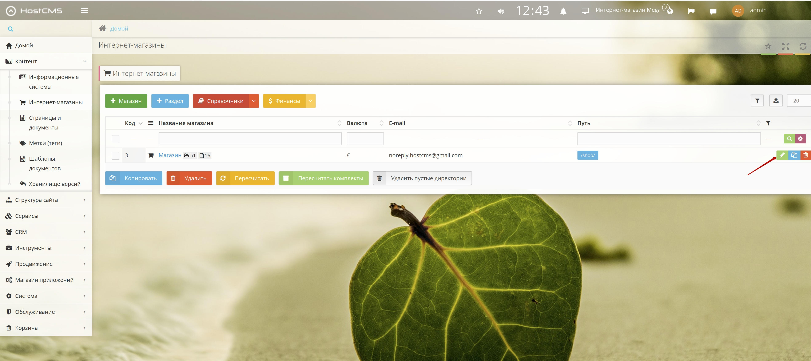
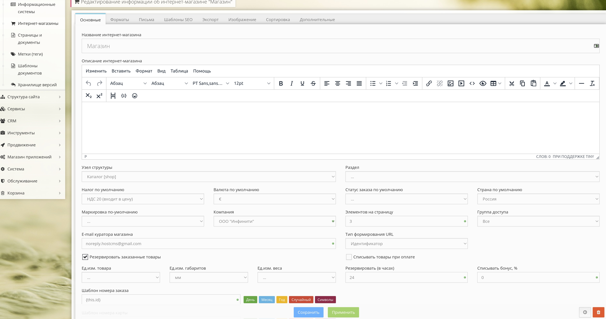

# HostCMS

1. Download the [module](https://github.com/unitpay/hostcms-module/archive/master.zip)
2. Go to the admin panel of your site
3. Go to Content -&gt;Online stores, select your store and then go to directories -&gt;payment systems.

4. Add a new payment system, write Unitpay in the name and for example, Unitpay payment system in the description and click Apply.

5. Click the Edit button next to the Unitpay payment system, then go to the Additional tab and remember the number in the ID field

6. Next, go to the Main tab and copy the contents of the module file handlerXX.php in the Handler field

7. In the name of Shop\_Payment\_System\_HandlerXX class, enter the ID you have previously remembered instead of XX.

8. In the handler, enter the values of the variables $domain = 'unitpay.ru', $public\_key and $secret\_key which you can get in your unitpay.money personal account

9. If necessary, assign the code of the currency \(which is available in the store\) in which you want to receive payments to the value of $currency\_name variable. It is RUB by default.

10. In your Unitpay.ru account, enter the address of the payment handler [http://&lt;your](http://<your) site address&gt;/shop/cart/

11. In order to set the VAT you need to go to Content -&gt; online shops, select your shop and then find the item, click edit

in the edit, there will be a tax and currency.

12. to change the currency in the entire store, go to content - &gt; online stores and click edit.

