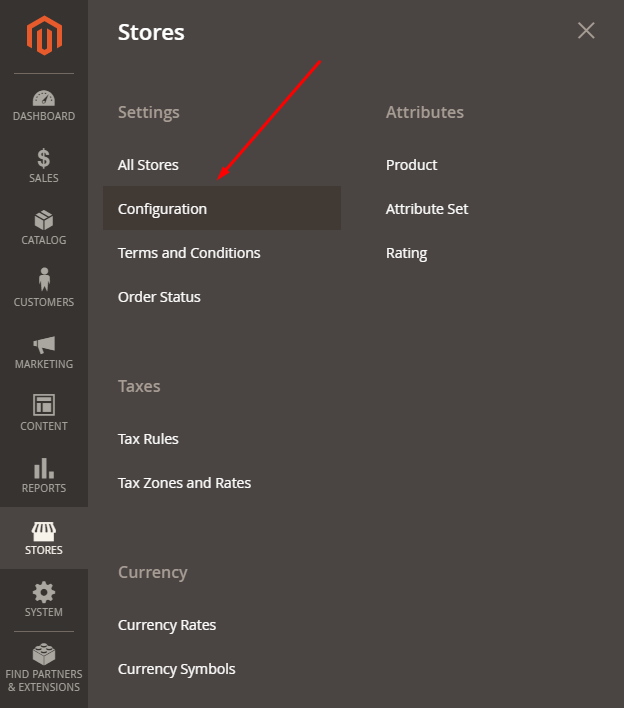
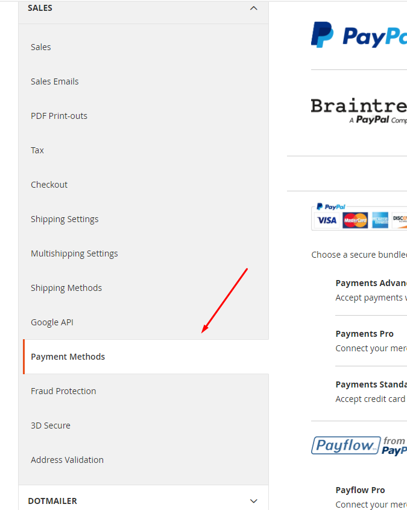
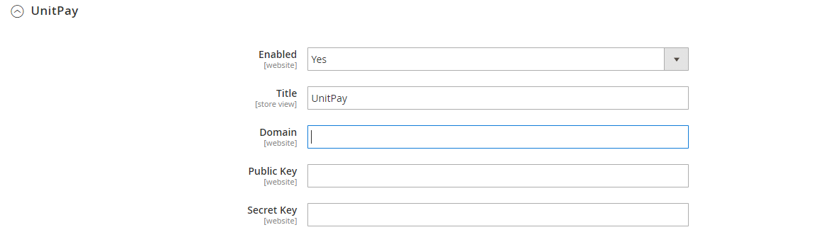
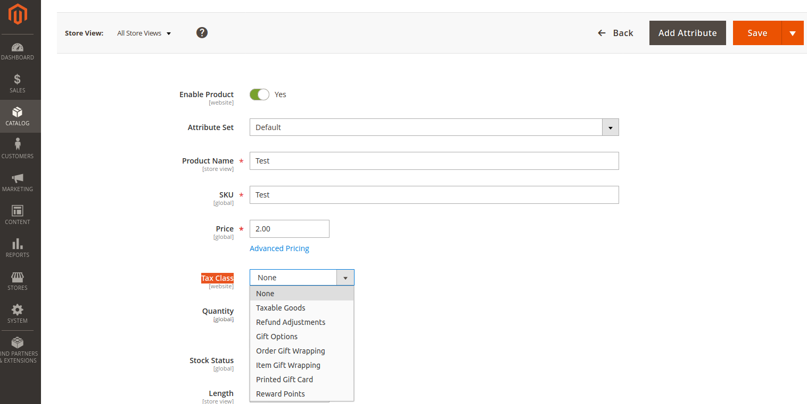
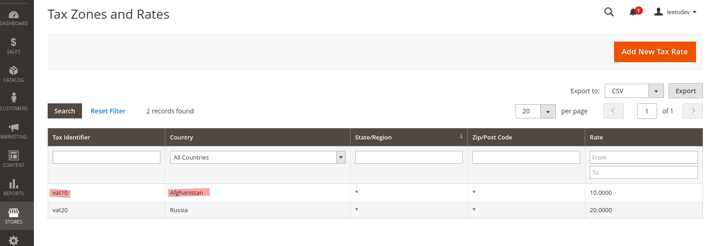

# Magento 2

### Instructions for configuring and installing the module. 

1.Download the [module archive](https://github.com/unitpay/magento2/archive/main.zip) and upload it to the site root.  

2. In the shell from the site root to run the command php bin/magento setup:upgrade to install module  

3. php bin/magento setup:di:compile for compiling configuration files  

4. Go to the admin panel. Stores -&gt; Configuration

5. In the left menu, select Sales -&gt; Payment Methods

6. Find the unitpay module and set the settings Domain \(**unitpay.ru**\), Public Key, Secret Key \(you can take it in the project settings in your personal account Unitpay\)

7. VAT can be set for each product. Catalogs -&gt; Products, click on the product, choose it Tax Class

Tax Class is configured in Stores -&gt; Tax Rules

Coverage area in Stores -&gt; Tax Zones and Rates

8. By default, delivery is valid for each product \(3 products = triple the cost of delivery\). To configure this, go to Stores -&gt; Configuration.Then in the sales drop down list Sales we look for Shipping methods

