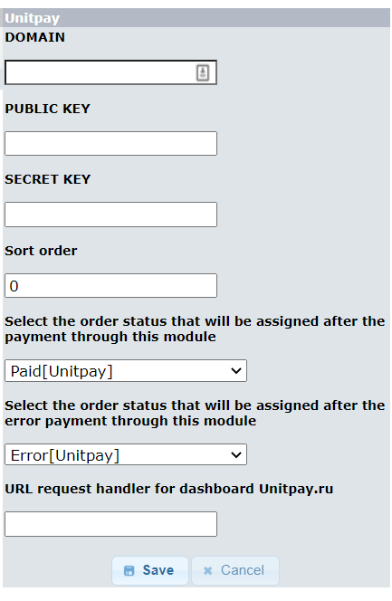
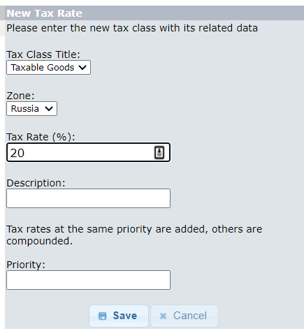
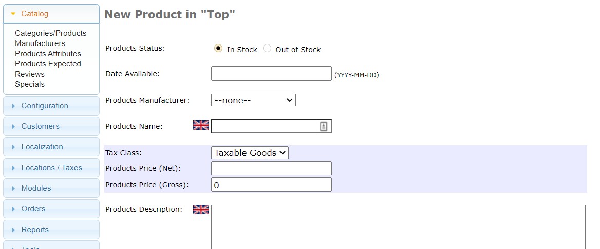

# osCommerce

**The Module Setup and Installation Instruction**

1. Download the [archive](https://github.com/unitpay/oscommerce-module/archive/master.zip) with the module.
2. Copy the contents of the unitpay directory from the archive to the root of your site.
3. Go to Modules -&gt;Payment.
4. Select Unitpay and click Install Module.
5. Click the Edit button for unitpay.

   

6. Enter the domain \(DOMAIN\) - unitpay.money, public key \(PUBLIC KEY\) and secret key \(SECRET KEY\), you can find them in your unitpay.money account.
7. If you need to, also enter the sorting order \(in what order the payment systems will be displayed on the payment system selection page\), the status of the order which will appear in case of successful payment \(it is Paid\[Unitpay\] by default\) and the status of the order which will appear in case of failed payment \(it is Error\[Unitpay\] by default\).
8. Click Save.
9. In your Unitpay.ru account, enter the address of the payment handler [http://&lt;your](http://<your) site address&gt;/unitpay.php

10. VAT for products is set on the page "Locations / Taxes" -&gt; "Tax Rates"

11. In the new product, set the desired one Tax Class 

