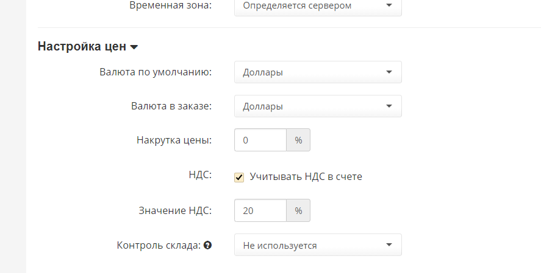

# PHPShop

**The Module Setup and Installation Instruction**

1. Download the [archive](https://github.com/unitpay/phpshop-module/archive/master.zip) with the module.
2. Unpack the contents of the archive to the root of the site.
3. Add the following lines in phpshop/inc/config.php file:

```text
[unitpay]

domain = "unitpay.ru";

public_key = "<Ваш публичный ключ из личного кабинета unitpay.ru>";

secret_key = "<Ваш секретный ключ из личного кабинета unitpay.ru>";
```

4. In the admin panel, go to Orders -&gt; Payment Methods and add Unitpay payment method. Check that the "Show" checkbox is checked.

5. In your unitpay.money account, enter the address of the payment handler [http://&lt;your](http://<your) site address&gt;/payment/unitpay/result.php


6. VAT and currency are set in "Settings" - &gt; "Main Settings". If you need to select "WITHOUT VAT", then uncheck "Include VAT in invoice".



