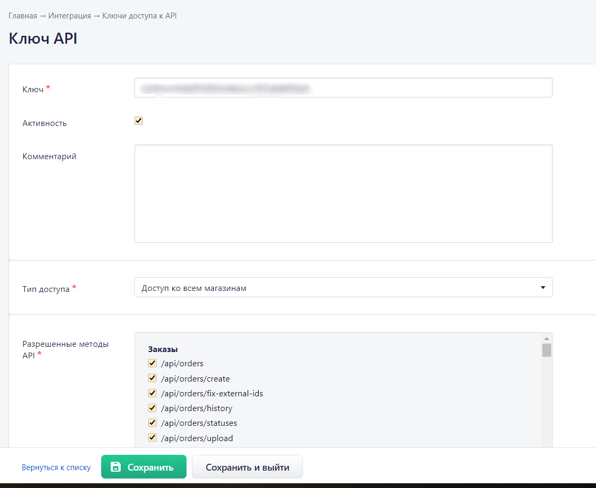
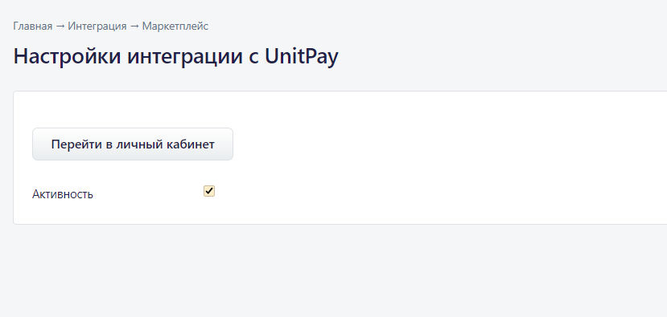
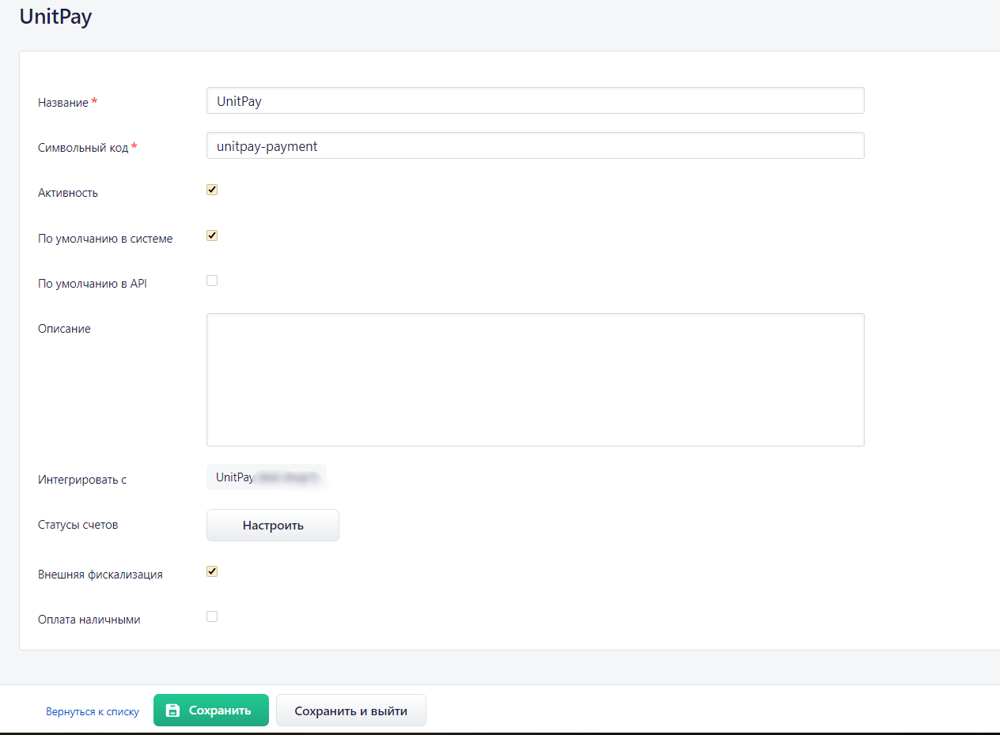
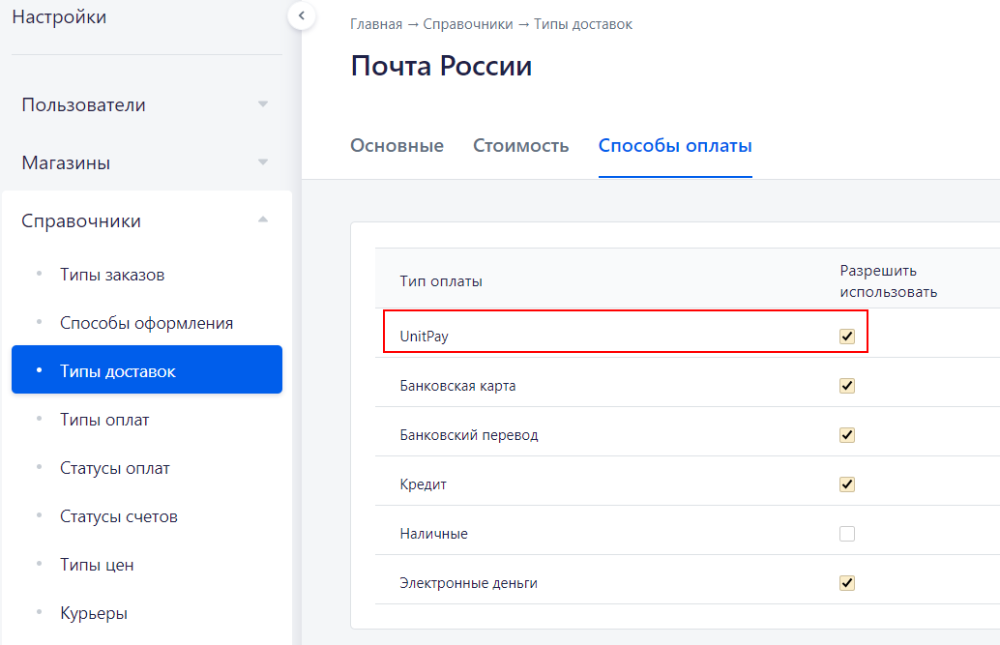

# RetailCRM

### Инструкция по настройке и установке модуля.

1\) Для работы с модулем необходимо удалить демо-данные \(если у вас подключен новый аккаунт в RetailCRM\)

2\) Создайте в системе API-ключ и скопируйте его Настройки -&gt; Интеграция -&gt; Ключи доступа к API -&gt; Создайте новый ключ \(в блоке "Разрешенные методы API" откройте доступ ко всем методам\).

Проверьте, чтобы в настройках API обязательно были выбраны данные методы:   
/api/integration-modules/{code}   
/api/integration-modules/{code}/edit   
/api/payment/\(updateInvoice\|check\)   
/api/reference/sites

3\) Установите модуль Unitpay из маркетплейса \(Настройки -&gt; Интеграция -&gt; Маркетплейс -&gt; Unitpay\)

4\) Откройте модуль и нажмите "Перейти в личный кабинет". 

5\) Настройте модуль:

* Public Key, Secret Key \(можете взять из настроек вашего проекта в личном кабинете Unitpay\)
* домен \(unitpay.ru\)
* Тип позиций, если у вас подключена онлайн-касса в Unitpay \([подробнее про параметр](https://help.unitpay.ru/online-cash-register/receipt_parameters)\)

6\) Скопируйте "Обработчик" из настроек модуля и установите его в настройках проекта в личном кабинете Unitpay.

7\) Перейдите в Настройки -&gt; Справочники -&gt; Типы оплат -&gt; Добавить "Новый тип оплаты":  
- Установите название и символьный код  
- Выберите "Интегрировать с" Unitpay  
- Установите статусы заказов  
- Установите "Внешняя фискализация", если вам нужно выбивать чеки.  
- Не забудьте установить "Активность" и "По умолчанию в системе"

8\) Добавление доставки   
Перейдите в Настройки -&gt; Справочники -&gt; Типы доставок   
Выберите нужный тип, в настройках перейдите на вкладку "Способы оплаты" и поставьте галку "Разрешить использовать" напротив Unitpay

9\) Выставление ссылки на оплату   
Заказы -&gt; Новый заказ -&gt; Заполните данные для формирования нового заказа -&gt; Скопируйте "Ссылка на оплату" из блока Unitpay

