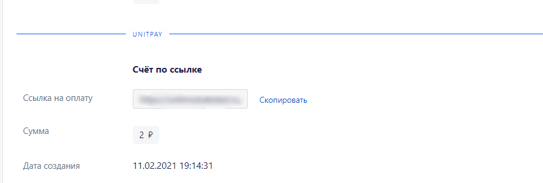

# RetailCRM

### Инструкция по настройке и установке модуля.

1\) Для работы с модулем необходимо удалить демо-данные \(если у вас подключен новый аккаунт в RetailCRM\)

2\) Создайте в системе API-ключ и скопируйте его Настройки → Интеграция → Ключи доступа к API → Создайте новый ключ \(в блоке "Разрешенные методы API" откройте доступ ко всем методам\).

Проверьте, чтобы в настройках API обязательно были выбраны данные методы:   
/api/integration-modules/{code}   
/api/integration-modules/{code}/edit   
/api/payment/\(updateInvoice\|check\)   
/api/reference/sites

3\) Установите модуль Unitpay из маркетплейса \(Настройки → Интеграция → Маркетплейс → Unitpay\)

4\) После этого обратитесь в [службу поддержки Unitpay](https://help.unitpay.ru/support) **manager@unitpay.ru**  
  
В запросе укажите:  
- id вашего проекта в Unitpay  
- тип позиций, если у вас подключена онлайн-касса в Unitpay \([подробнее про параметр](https://help.unitpay.ru/online-cash-register/receipt_parameters)\)  
- URL под которым у вас открывается RetailCRM  
- API-ключ из пункта \(2\)  
  
Мы сами добавим настройки в установленный модуль и на стороне Unitpay.

7\) Перейдите в Настройки → Справочники → Типы оплат → Добавить "Новый тип оплаты":  
- Установите название и символьный код  
- Выберите "Интегрировать с" Unitpay  
- Установите статусы заказов  
- Установите "Внешняя фискализация", если вам нужно выбивать чеки.  
- Не забудьте установить "Активность" 

8\) Добавление доставки   
Перейдите в Настройки → Справочники → Типы доставок   
Выберите нужный тип, в настройках перейдите на вкладку "Способы оплаты" и поставьте галку "Разрешить использовать" напротив Unitpay

9\) Выставление ссылки на оплату   
Заказы → Новый заказ → Заполните данные для формирования нового заказа → Скопируйте "Ссылка на оплату" из блока Unitpay

