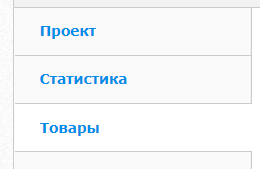
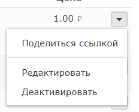
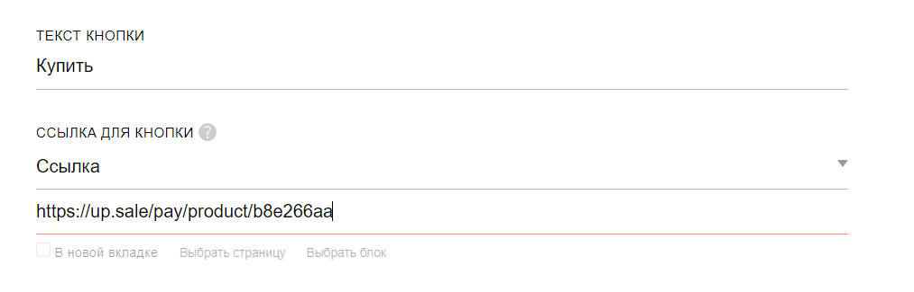

# Tilda

### Инструкция по настройке и приема оплат в Tilda

В данный момент для сервиса Tilda поддерживается оплата только по ссылке. Для этого необходимо:

1. Перейдите в раздел «Товары» в личном кабинете Unitpay \(данный раздел доступен после согласования, обратитесь к своему персональному менеджеру или в нашу службу поддержки\)     
2. Нажмите «Добавить товар» и заполните название товара, цену и дополнительные поля. подробнее об оплате по ссылке можете [почитать тут](https://help.unitpay.ru/payments/payment-links). 
3. После создания в выпадающем меню нажмите «Поделиться ссылкой» и скопируйте URL.    
4. После этого перейдите в кабинет Tilda, добавьте кнопку для оплаты товара. Перейдите в «Контент», добавьте название кнопки и ссылку.  После этого опубликуйте все страницы.  

