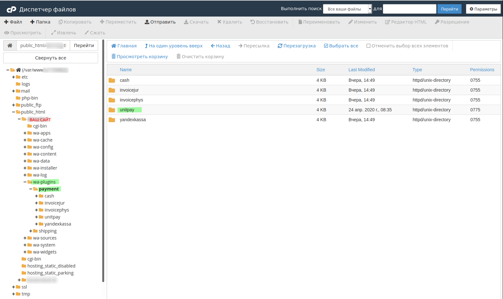
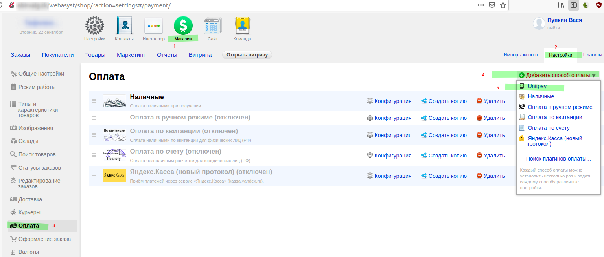
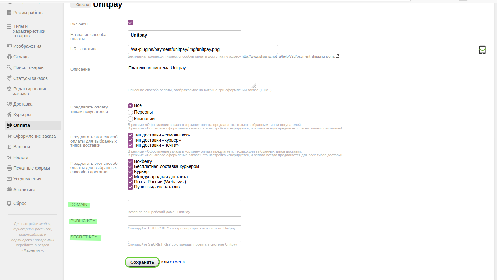
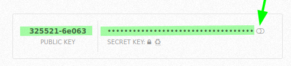
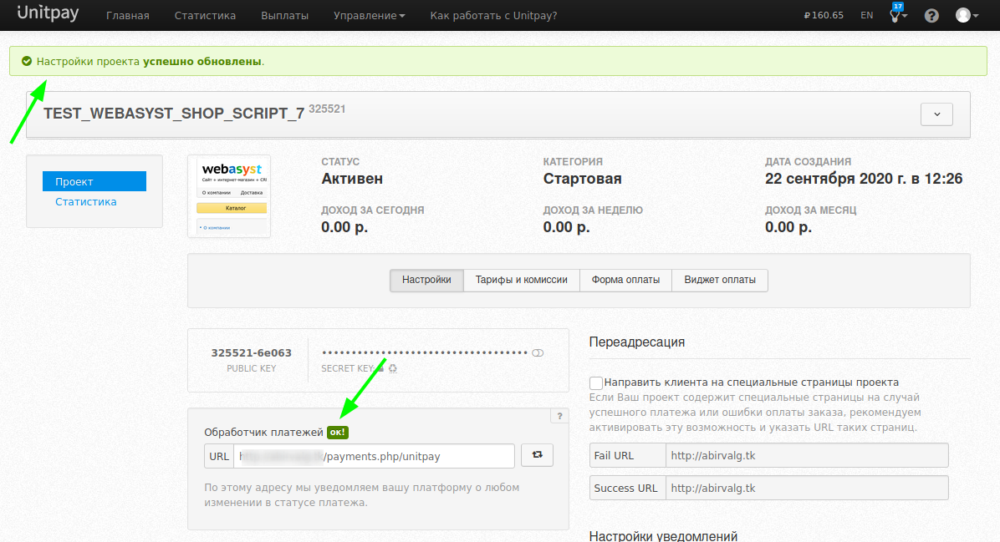
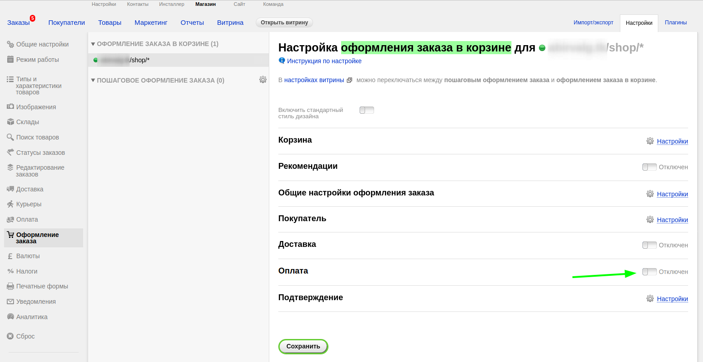

# Webasyst Shop Script 7 \(8\)

#### Инструкция по установке и настройке модуля.

1. Скачайте [архив](https://github.com/unitpay/shopscript-module/releases/tag/v2.1.0) с модулем \(.zip\).

2. Копируем папку unitpay в wa-plugins/payment _\(ещё wa-plugins/payment есть внутри wa-sources - это не та директория что нужна, не перепутайте\)._

3. Переходим в панель управления магазином "**Настройки → Оплата → Добавить способ оплаты → Unitpay**"

4. Поля DOMAIN \(unitpay.ru\), PUBLIC KEY и SECRET KEY можно взять со страницы вашего проекта на unitpay. Проверьте, чтобы у модуля стояла галочка "**Включен**".

5. На странице проекта в личном кабинете unitpay пропишите обработчик платежей по шаблону:[ http://адрес\_вашего\_сайта/payments.php/unitpay](http://xn--__-6kcbbakjfkd5c8cvaqht4h/payments.php/unitpay) и нажмите enter. 

Если не ошиблись, то в обработчике платеже будет написано **ОК!**

6. ДОПОЛНЕНИЕ: чтобы в магазине можно было оплачивать товар нужно включить этот шаг. "**Магазин → Настройки → Оформление заказа → включите шаг Оплаты**".


В модуле поддерживаются промокоды, мультивалютность, НДС и разные [types](https://help.unitpay.ru/online-cash-register/receipt_parameters).


