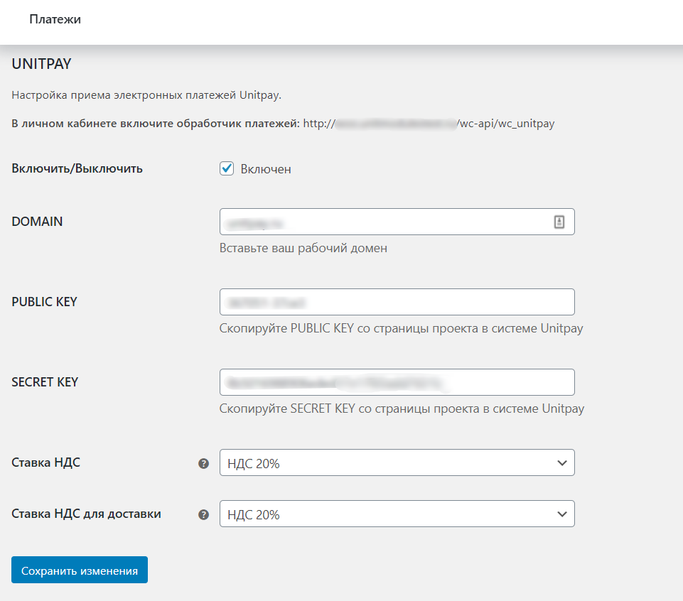
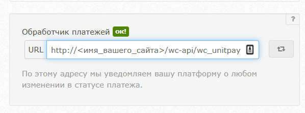

# Woocommerce Wordpress

### Инструкция по настройке и установке модуля.

1. Скачайте [архив](https://github.com/unitpay/woocommerce-module/archive/master.zip) с модулем.

2. Скопируйте директорию unitpay в архиве в директорию /&lt;корень сайта&gt;/wp-content/plugins/.

3. Зайдите в "Плагины"-&gt; "Установленные" и нажмите "Активировать" напротив плагина UnitPay.

4. Выберите в меню "WooCommerce" -&gt; "Настройки" и перейдите на вкладку "Платежи", там выберите UnitPay.

5. В поле **DOMAIN** вставьте значение **unitpay.ru** . В поля PUBLIC KEY и SECRET KEY скопируйте публичный и секретный ключ, которые вы можете взять из личного кабинета Unitpay. Нажмите на кнопку "Сохранить изменения".

6. НДС ставится внутри настроек модуля.

7. Введите в личном кабинете Unitpay.ru обработчик платежей по шаблону  [http://&lt;имя\_вашего\_сайта&gt;](http://xn--%3C__-7vebaolv6au8a9a1ct4h3f/)/wc-api/wc\_unitpay


В модуле также поддерживаются [коды маркировки товаров](https://help.unitpay.ru/online-cash-register/receipt_parameters) и промокоды, кроме автоматических правил, бонусов и подарочных сертификатов.


 

