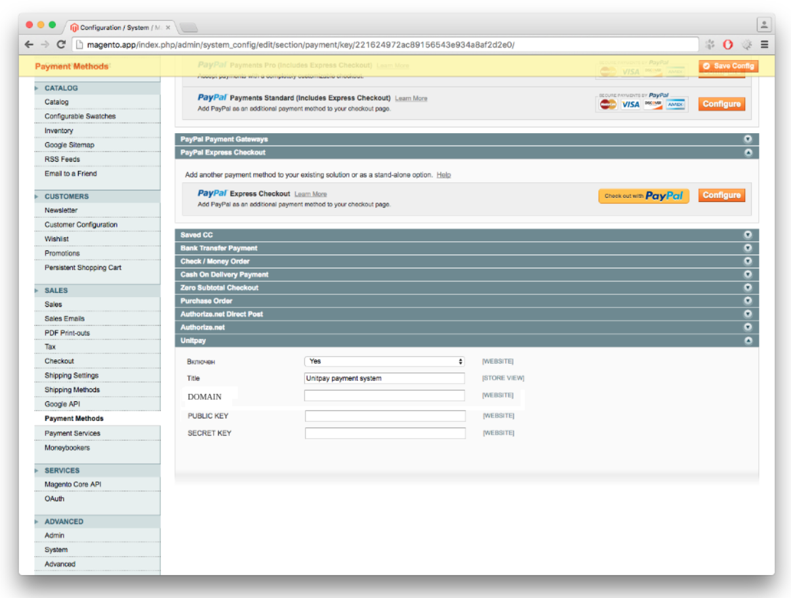

# Magento

**The Module Setup and Installation Instruction**

1. Download the [archive](https://github.com/unitpay/magento-module) with the module.
2. Copy the contents of the unitpay directory from the archive to the root of your site.
3. Disable caching, to do this, go to the System -&gt; Cache management, click Select all and select Actions Disable in the drop-down list on the right, then click Submit.

1. Now go to System-&gt; Configuration and select Payment Methods from the menu on the left. You will see the Unitpay line among the payment methods. Click on it and enter DOMAIN \(unitpay.money\), PUBLIC KEY, and SECRET KEY, which you can get in your personal account on the Untipay.money website, in the opened parameters. After entering, click Save Config.

1. Now you can enable caching again.
2. Enter the payment handler in your Unitpay.ru account using the template: [http://&lt;your\_site\_name&gt;//index.php/unitpay/index/callback](http://<your_site_name>//index.php/unitpay/index/callback)

1. The module was tested on Magento version 1.9.2.4

