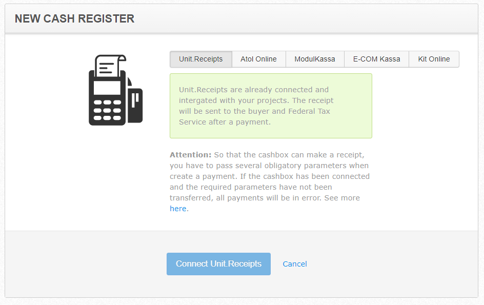

# Unit.Reciepts

**Unit.Reciepts** is an alternative to Unitpay's online cash register. Our solution makes the job of sending cheques as easy as possible for you: you put it entirely in our hands. We send reciepts to your customers and to the OFD, from where the data is passed on to the tax office. No need to keep track of overflow fiscal drive, separately register a cash register in a private office of the tax office or rent a cash register - the whole process of connection takes a few clicks.

Unit.Reciepts is connected after passing the previous stages - **sending of questionnaires and founding documents** and [moderation of the project](https://help.unitpay.ru/v/master/first_steps/adding-project). 

1. You have to go to Management - Online Cash Registers - choose Unit.Reciepts.

2. Then you need to choose your type of taxation and method of calculation, read the terms of the agency agreement, and click "Connect".

3. Ready! Unit.Reciepts are activated for your account:

4. You'll also receive a notification in your personal cabinet:


After connecting Unit.Receipts do not forget about transferring us additional parameters that are necessary for correct work of online cash desk and payment solution. Without [them](https://help.unitpay.ru/v/master/payments/parameters-for-receipts) the payment solution will not work!


