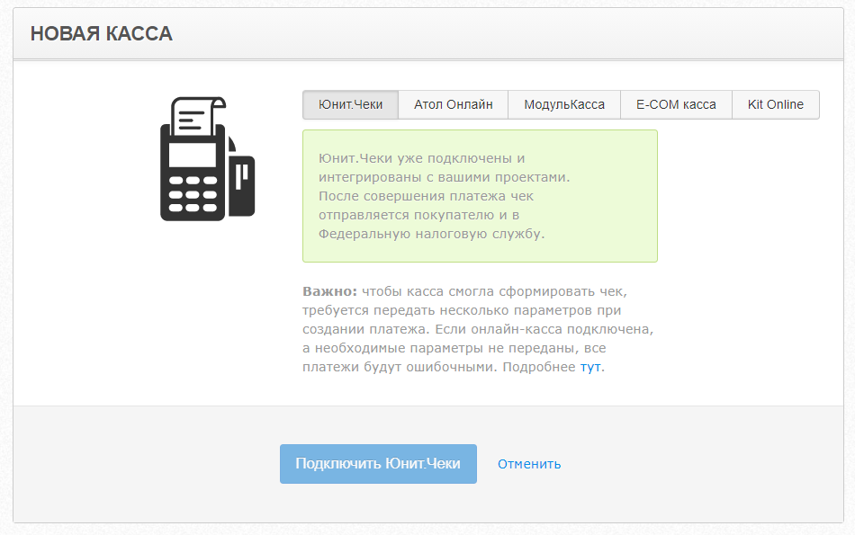

# Юнит.Чеки

**Юнит.Чеки** - это альтернативный вариант онлайн-кассы от Unitpay. Наше решение максимально облегчает вам работу по отправке чеков: вы полностью отдаете ее в наши руки. Мы отправляем чеки вашим клиентам и в ОФД, откуда данные передаются в налоговую. Не нужно следить за переполнением фискального накопителя, отдельно регистрировать кассу в личном кабинете налоговой или арендовать ККТ - весь процесс подключения занимает несколько кликов.

Юнит.Чеки подключаются после прохождения предыдущих этапов - [отправления анкет и учредительных документов](https://help.unitpay.ru/unitpay-management/instrukciya-po-interfeisu#vyplaty) и [модерации проекта](https://help.unitpay.ru/first_steps/moderation#okonchatelnaya-moderaciya-proekta).

1. Вам необходимо зайти в Управление - Онлайн-кассы - выбрать Юнит.Чеки.

2. Далее нужно выбрать свой тип налогообложения и способ расчета, ознакомиться с условиями [агентского договора](https://unitpay.ru/agent_offer_unit_receipts), нажать "Подключить".

3. Готово! Онлайн-касса подключена:

4. Дополнительно вам также придет уведомление в личном кабинете:


После подключения Юнит.Чеков не забывайте про передачу нам [дополнительных параметров](https://help.unitpay.ru/online-cash-register/receipt_parameters), необходимых для корректной работы онлайн-кассы и платежного решения. **Без них платежное решение работать не будет!**


