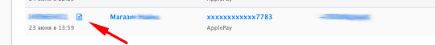

# Просмотр чека


Электронные чеки формируются, если у вас подключена онлайн-касса: Юнит.Чеки, Атол или E-com



Чтобы получить ссылку на электронный чек, воспользуйтесь запросом ["Информация о платеже"](../payments/payment-info.md)


Электронный чек можно просмотреть и из личного кабинета, для этого:

1. Авторизуйтесь
2. Зайдите в проект
3. Откройте таб "Статистика"
4. Кликните на иконку рядом с платежом

