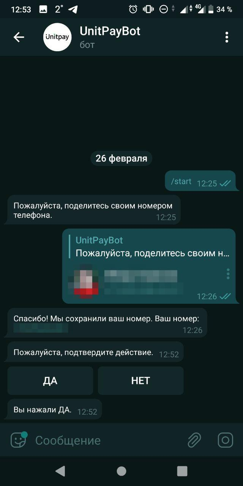
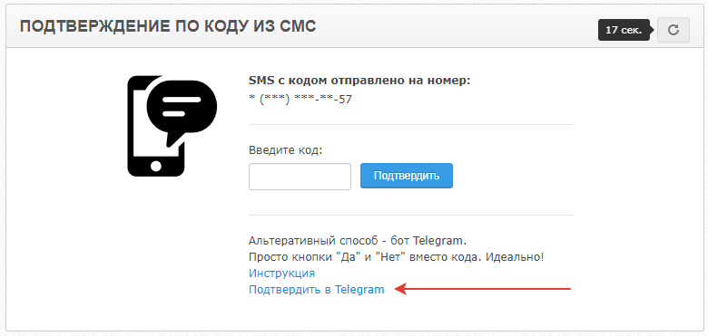

# Telegram bot

Two-factor authentication allows you to effectively protect your account from unauthorized access, thereby protecting personal data - access to transaction history, project settings and financial information.   
  
We have two options for two-factor authentication: login with a one-time password from SMS, or confirmation of login via Telegram bot.

## Telegram bot features:

* authorization confirmation
* receive payments notifications

**Adding the Telegram UnitPayBot bot.**

1\) Launch the bot using the link [https://t.me/unitpaybot](https://t.me/unitpaybot) or find _@UnitPayBot_ in Telegram.

2\) Click the START button.

3\) The bot will offer to share your phone number.

4\) Share your phone number

_By default, Telegram does not share phone numbers to bots._

Click Share my number and then confirm your intention by clicking on SHARE MY CONTACT.

5\) Your number will be saved.

Now you can use Telegram instead of SMS codes. This method will be saved in your account **as the main one**.

**How to make Telegram method as the main one?**

1. Log in
2. Go to your account settings
3. Choose verification method 'Telegram'
4. Click 'Save changes' button

**How do I confirm my actions via Telegram?**

In the Unitpay interface, you will see a notification that a request has been sent to the Telegram account linked to the phone number.

This is what the request looks like in the Telegram app for mobile devices.

How to receive payments notifications in Telegram?

_Ensure you have added UnitPayBot_

1. Go to your Project settings
2. Tick checkbox 'Notify by telegram'

1. Click 'Save' button

**How do I confirm my registration or log in using the Telegram bot?**

Already **during registration** or when **logging in** to your account, you or your employee can choose an alternative way to confirm actions or switch back. **After adding the UnitPayBot bot** \(see above\), click Confirm in Telegram.

You can always change the notification channel to the receipt of SMS with a code by clicking Get code in SMS.

