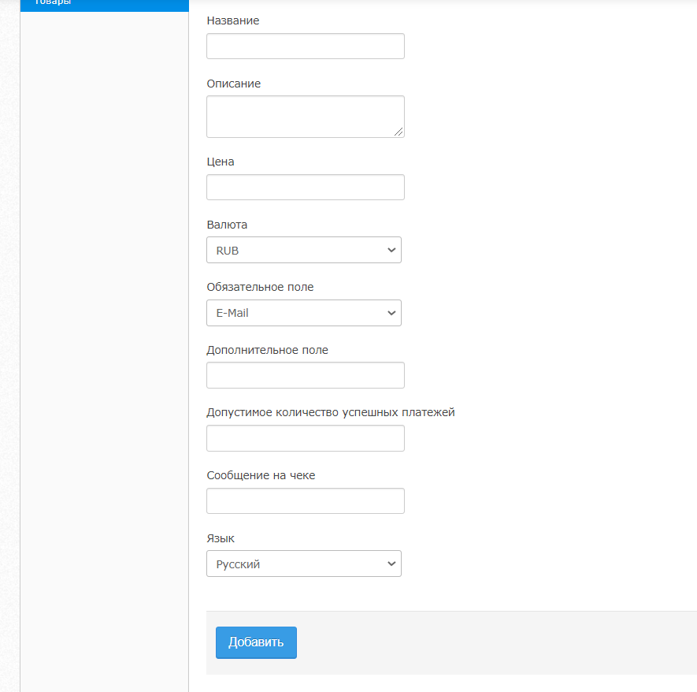

# Creating Payment Links in Your Personal Account

**How do I create a payment link in my account?**

In February 2020, Unitpay launched a new solution: **creating payment links in your personal account**. In this case, you **do not need** to integrate the payment solution with the site and work with the **API**.

To get a payment link, select the **Products** section in the active project settings.

The function can be used only after approval. Please contact your account manager or the Unitpay customer support - Unit.Help.

To add a new product, click **\[+ Add product\]** and fill in the following fields:

**Name** is the name of the product that the payer will see before paying.

**Description** is the description of the product that the payer will see before paying.

**Price** is the amount that will be billed to the payer.

**Currency** - the order currency according to ISO 4217 \(RUB, UAH, BYN, EUR, USD etc. [Currency codes](../book-of-reference/currency-codes.md)\).

**Message on the receipt** - information that the user will see after successful payment. 

**Language** - the form language \(Russian/English\).

**Mandatory field** is a question that the payer must answer before paying. The response will be used in the Statistics section - it will help to easily find payments from specific users. You can select one of the mandatory fields: E-mail and Phone number.

**Additional field** is the text of an additional question that the customer may answer before paying. The response will be displayed in the Statistics section next to the mandatory field.

**Maximum allowed number of successful payment** means that a partner can set a limit on the number of successful payments per product. If the field remains empty, the limit will not be set.

This way the product will be created and available for sale:

**What can I do with the created Product?**

In the product menu, you can:

1. **Share a product link**:
2. copy a payment link;
3. download the QR code for payment as an image.

Please note: links are created in the **up.sale** domain.

1. **Edit the product.**

After creating the product, you can edit the **Price**, **Mandatory field**, **Additional field**, and **Maximum allowed number of successful payments**. You cannot edit **Names** or **Product descriptions** since all products and their description are moderated by the security department after being added.

1. **Deactivate an** active **product**.

When clicking on the link to the deactivated product, the payer will see _Error 404. Page not found_".

1. **Activate an** inactive **product**.

**How does the payment process work?**

After clicking on the link, the payer first sees an additional window with the product **name**, product **description**, payment **amount**, and the **fields** you selected to fill in:

After entering the data and clicking the "Go to payment" button, the payer gets to the standard payment form.

You can see the information specified by the payer in the _Invoice No._ column in the _Payment Details_ section.

