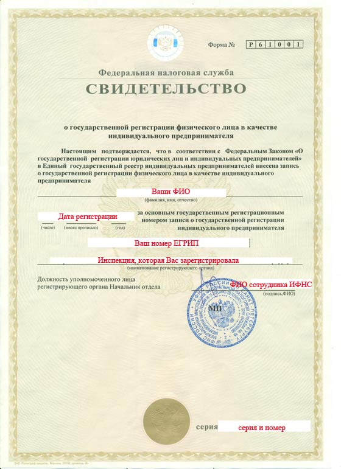
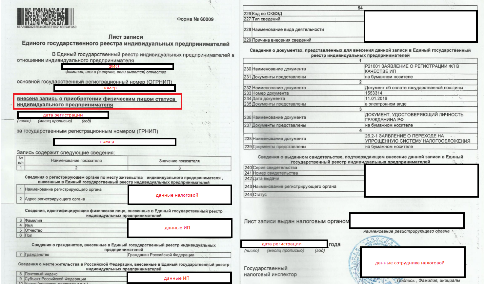
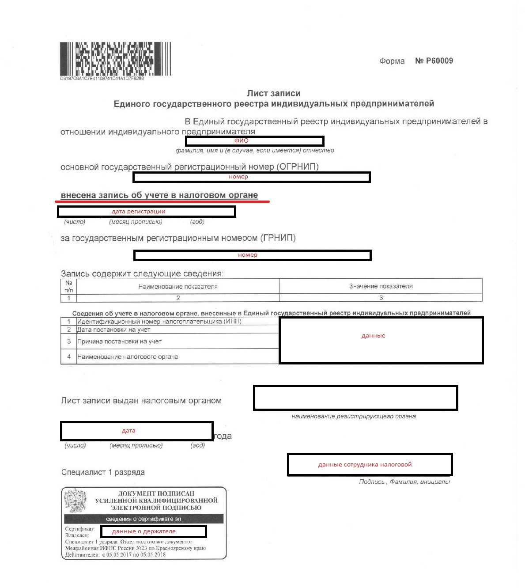
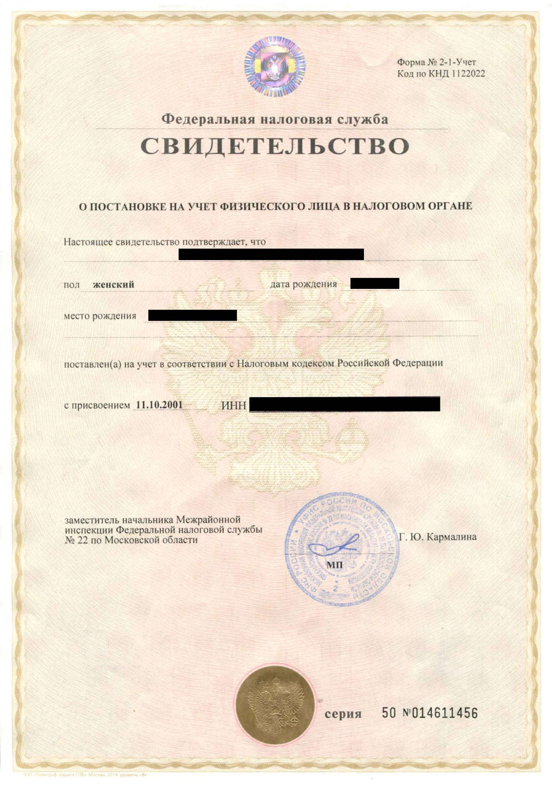
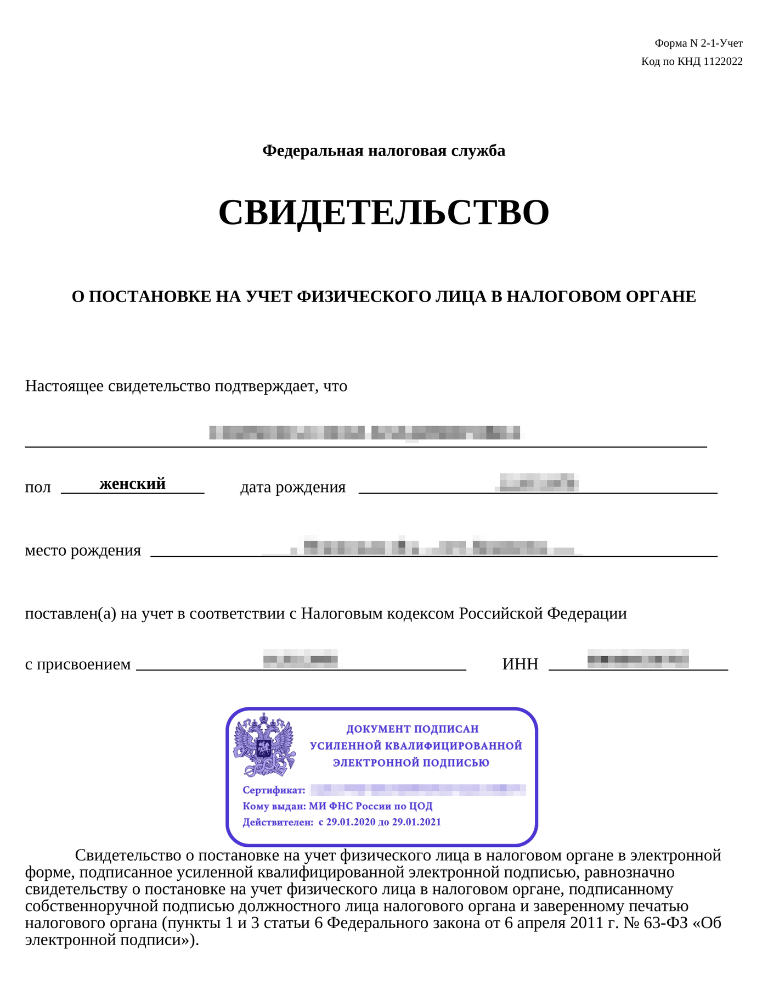
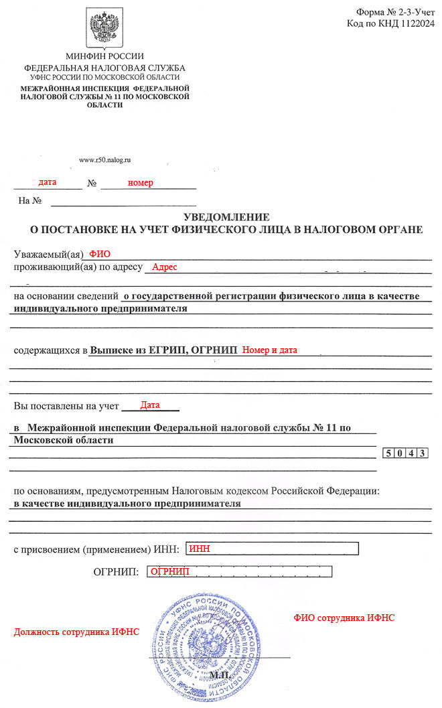

# Пакет документов для ИП

На этапе отправки документов мы просим вас собрать качественный заверенный пакет документов. 


Заверить скан-копии необходимо следующим образом: поставить дату, подпись, фамилию с инициалами с приставкой "ИП" или "Индивидуальный предприниматель" или “руководитель / ген. директор ООО” и печать \(для ИП при наличии\). 



Скан-копии принимаются в формате .pdf. При возможности, пожалуйста, избегайте отправку фото .jpg / .jpeg. Мы не примем документы, если они будут в плохом качестве: размытые нечитаемые изображения, на документах будут видны ваши пальцы, вотермарки или любые посторонние надписи, на фоне будут присутствовать посторонние люди или предметы.


Ниже опубликованы наглядные примеры документов **для ИП.**

## **1. Свидетельство о государственной регистрации физического лица в качестве индивидуального предпринимателя \(ОГРНИП\), которые получали до 2017 года**

## **1.1. Лист записи о создании ИП, который выдают после 2017 года**


**Имейте, пожалуйста, в виду, что нам необходим  
“полный” Лист записи, в котором будут указаны имя, адрес, коды ОКВЭД и др.  
\(то есть лист записи, свидетельствующий о регистрации физического лица в качестве индивидуального предпринимателя\).  
Не стоит путать такой Лист записи с тем, который просто сообщает, что в ЕГРИП была внесена запись об учете в налоговом органе или с Листом записи о внесении изменений в ЕГРИП \(примеры ниже\)**


## **2. Свидетельство о постановке на учёт в налоговом органе \(ИНН\), которое выдавали до 2017 года**

## **2.1. Свидетельство или уведомление о постановке на учёт в налоговом органе \(ИНН\), которое получают после 2017 года**

  
****

