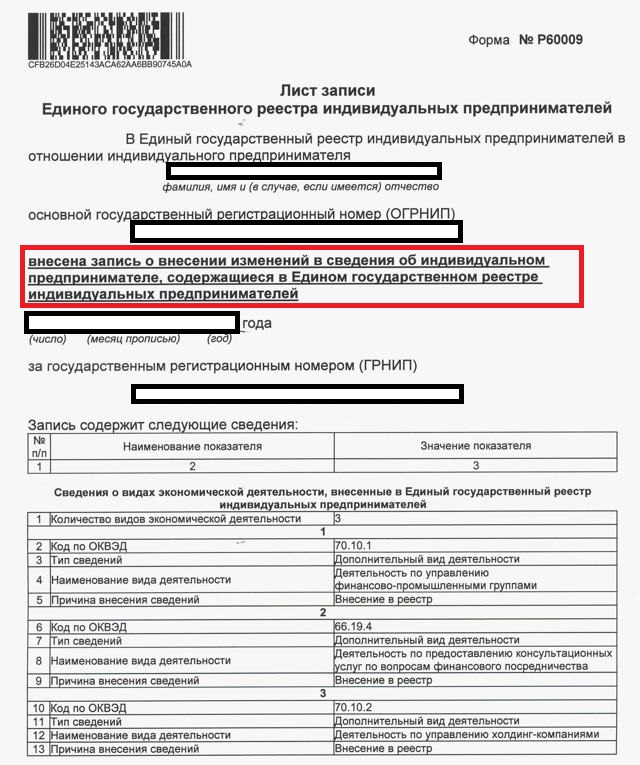
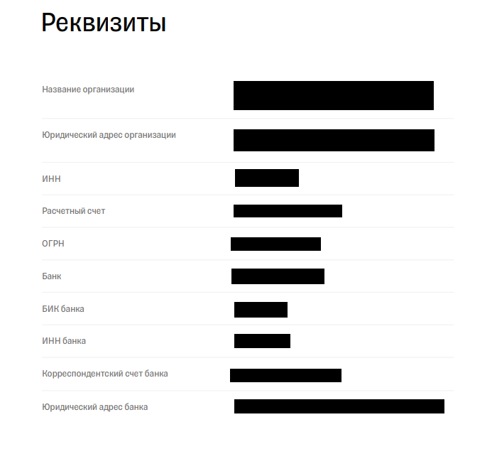

# Пакет документов для ИП

На этапе отправки документов мы просим вас собрать качественный заверенный пакет документов.&#x20;


Заверить скан-копии необходимо следующим образом: поставить подпись, фамилию с инициалами с приставкой "ИП" или "Индивидуальный предприниматель" и печать (при наличии).



Скан-копии принимаются в формате .pdf. При возможности, пожалуйста, избегайте отправку фото .jpg / .jpeg. Мы не примем документы, если они будут в плохом качестве: размытые нечитаемые изображения, на документах будут видны ваши пальцы, вотермарки или любые посторонние надписи, на фоне будут присутствовать посторонние люди или предметы.


Ниже опубликованы наглядные примеры документов **для ИП.**

## **1. Свидетельство о государственной регистрации физического лица в качестве индивидуального предпринимателя (ОГРНИП), которые выдавали до 2017 года**

## **1.1. Лист записи о создании ИП, который выдают после 2017 года**


**Имейте, пожалуйста, в виду, что нам необходим**\
**“полный” Лист записи, в котором будут указаны имя, адрес, коды ОКВЭД и др.**\
**(то есть лист записи, свидетельствующий о регистрации физического лица в качестве индивидуального предпринимателя).**\
**Не стоит путать такой Лист записи с тем, который просто сообщает, что в ЕГРИП была внесена запись об учете в налоговом органе или с Листом записи о внесении изменений в ЕГРИП (примеры ниже)**


## **2. Свидетельство о постановке на учёт в налоговом органе (ИНН), которое выдавали до 2017 года**

## **2.1. Свидетельство или уведомление о постановке на учёт в налоговом органе (ИНН), которое выдают после 2017 года**

## **3.** Паспорт ИП (первый разворот + регистрация)

## 4. Платежные реквизиты

Можно сформировать файл самостоятельно или выгрузить готовый файл с реквизитами из приложения банка, где был открыт расчетный счет, например:

## 5. Лицензия (если вид деятельности подлежит лицензированию)

Лицензирование — это ограничение административно-правового статуса юридического лица или индивидуального предпринимателя. Оно выражено в обязанности получить специальное разрешение государства на ведение отдельных направлений бизнеса. В соответствии со статьей 12 Федерального закона № 99-ФЗ от 04.05.2011, к видам деятельности, требующим получения лицензии, относятся 57 направлений. Каждому из них соответствует свое положение, утвержденное Правительством РФ.&#x20;


Узнать о том, подлежит ли ваша деятельность лицензированию, можно [по ссылке](http://www.consultant.ru/document/cons\_doc\_LAW\_113658/6a4a5b5468ba8b99831699f7d048d2a5d7710610/).

