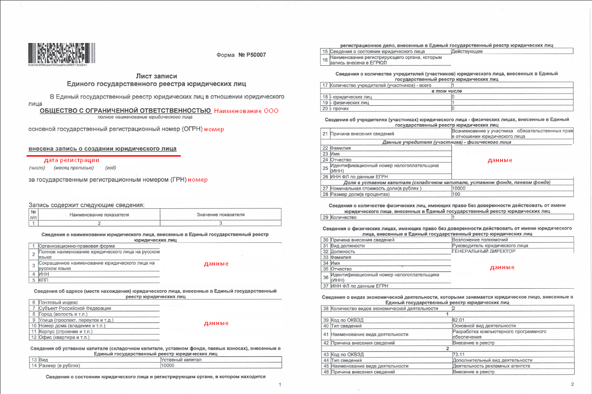

# Legal entity documents

At the stage of sending documents, we ask you to collect a high-quality certified package of documents.


The scanned copies must be certified as follows: date, signature, surname with initials with the prefix “head / general director of LLC” and seal.



Scanned copies are accepted in .pdf format. If it's possible, please, avoid sending .jpg / .jpeg photos. We won't accept documents if they are in poor quality: blurry unreadable images, your fingers, watermarks or any extraneous inscriptions will be visible on the documents, or there will be strangers/objects in the background.


Illustrative examples of documents for **legal entities** are published below.

## **1. Certificate of state registration of an individual as an individual entrepreneur (OGRN), which was issued before 2017**

## **1.1.** A record sheet on the creation of an individual entrepreneur, which is issued after 2017


Please, keep in mind that we need “Complete” Record Sheet, which contains the name, address, OKVED codes, etc. (a record sheet indicating the registration of an individual as an individual entrepreneur). You should not confuse such a Record Sheet with the one that simply informs that a record was made in the USRLE record about accounting with the tax authority or with the Record Sheet on making changes to USRLE (examples below)


## **2. Certificate of registration with the tax authority (TIN), which was issued before 2017**

## **2.1. Certificate or notification of registration with the tax authority (TIN), which is issued after 2017**

## **3.** A document confirming the use of special tax regimes: STS, UTII (for example, notification of the possibility of switching to a simplified taxation system, patent, etc.)

## **4.** Passport (first spread + registration of the head of a legal entity / person acting under a power of attorney)

## 5. Beneficial owner's passport (first spread + registration of the beneficial owner of the legal entity / person)

## 6. Charter and its list of changes

## 7. Payment details

You can generate a file yourself or upload a ready-made file with details from the bank application where the current account was opened, for example:

## 8. License (if the type of activity is subject to licensing)

Licensing is a limitation of the administrative and legal status of a legal entity or individual entrepreneur. It is expressed in the obligation to obtain special permission from the state to conduct certain areas of business. In accordance with Article 12 of Federal Law No. 99-FZ of 04/05/2011, 57 areas of activity require a license. Each of them corresponds to its own position, approved by the Government of the Russian Federation.


You can find out if your activity is subject to licensing by following [the link](http://www.consultant.ru/document/cons\_doc\_LAW\_113658/6a4a5b5468ba8b99831699f7d048d2a5d7710610/).


##
