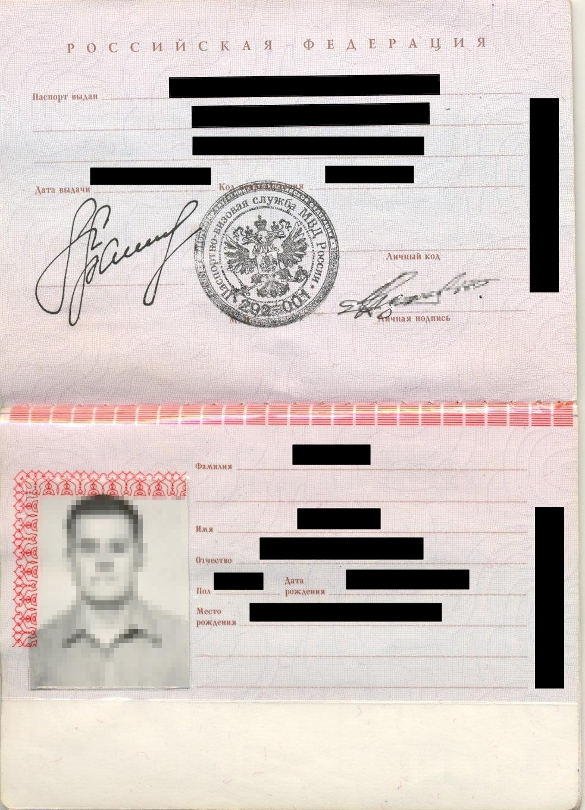

# Пакет документов для ООО

На этапе отправки документов мы просим вас собрать качественный заверенный пакет документов. 


Заверить скан-копии необходимо следующим образом: поставить дату, подпись, фамилию с инициалами с приставкой "ИП" или "Индивидуальный предприниматель" или “руководитель / ген. директор ООО” и печать \(для ИП при наличии\). 



Скан-копии принимаются в формате .pdf. При возможности, пожалуйста, избегайте отправку фото .jpg / .jpeg. Мы не примем документы, если они будут в плохом качестве: размытые нечитаемые изображения, на документах будут видны ваши пальцы, вотермарки или любые посторонние надписи, на фоне будут присутствовать посторонние люди или предметы.


Ниже опубликованы наглядные примеры документов **для ООО.**

## **1. Свидетельство о государственной регистрации юридического лица \(ОГРН\), которые получали до 2017 г.**

## **1.1. Лист записи о создании юридического лица, который выдают после 2017 г.**


**Имейте, пожалуйста, в виду, что нам необходим  
“полный” Лист записи, в котором будут указаны имя, адрес, коды ОКВЭД и др.  
Также не стоит путать основной Лист записи, сообщающий о создании ООО, с Листом записи о внесении изменений в ЕГРЮЛ \(на скриншоте ниже\)**


## **2. Свидетельство о постановке на учет в налоговом органе \(ИНН\), которое получали до 2017 года**

## **2.1. Свидетельство о постановке на учет в налоговом органе \(ИНН\), которое выдают после 2017 года**

## **3.** Документ, подтверждающий применение специальных налоговых режимов: УСН, ЕНВД \(например, уведомление о возможности перехода на упрощенную систему налогообложения, патент и т.п.\)

## **4.** Паспорт \(первый разворот + регистрация руководителя юридического лица/лица, действующего по доверенности\)

## 5. Паспорт бенефициарного владельца \(первый разворот + регистрация бенефициарного владельца юридического лица/лица\)

## 6. Фотография-селфи руководителя организации или представителя по доверенности на фоне основного разворота паспорта


Обратите внимание, что селфи с паспортом не должно содержать дополнительных надписей.


## 7. Устав и список изменений к нему

## 8. Платежные реквизиты

Можно сформировать файл самостоятельно или выгрузить готовый файл с реквизитами из приложения банка, где был открыт расчетный счет, например:

## 9. Лицензия \(если вид деятельности подлежит лицензированию\)

Лицензирование — это ограничение административно-правового статуса юридического лица или индивидуального предпринимателя. Оно выражено в обязанности получить специальное разрешение государства на ведение отдельных направлений бизнеса. В соответствии со статьей 12 Федерального закона № 99-ФЗ от 04.05.2011, к видам деятельности, требующим получения лицензии, относятся 57 направлений. Каждому из них соответствует свое положение, утвержденное Правительством РФ. 


Узнать о том, подлежит ли ваша деятельность лицензированию, можно [по ссылке](http://www.consultant.ru/document/cons_doc_LAW_113658/6a4a5b5468ba8b99831699f7d048d2a5d7710610/).


