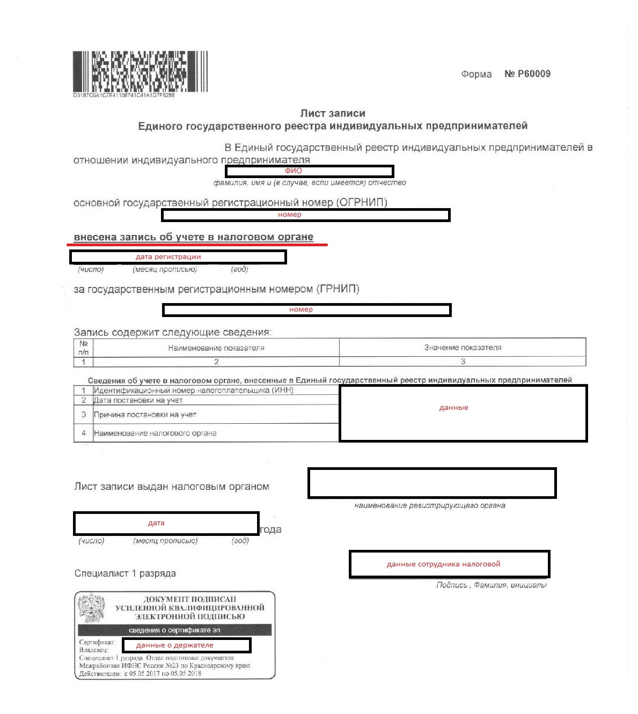
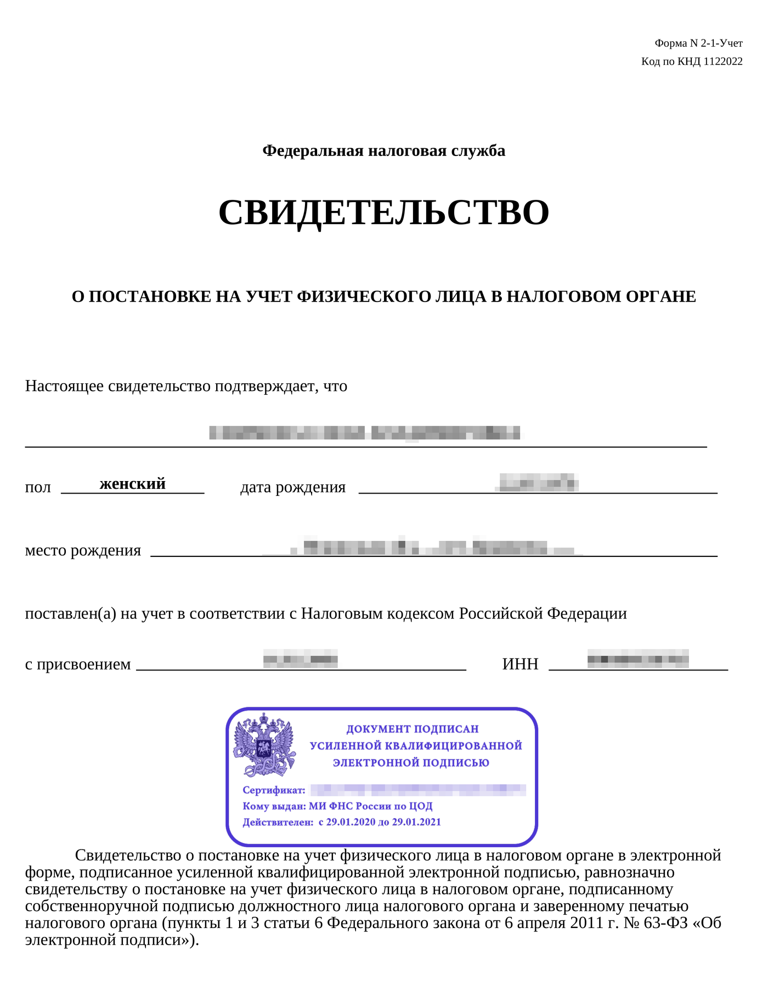
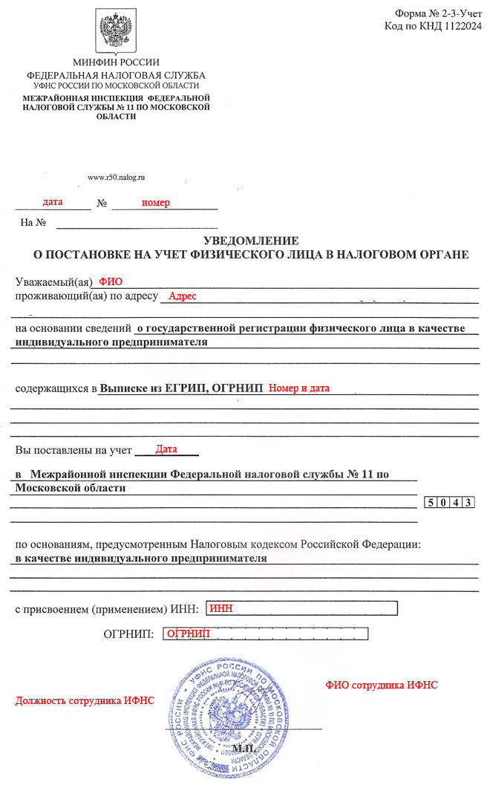
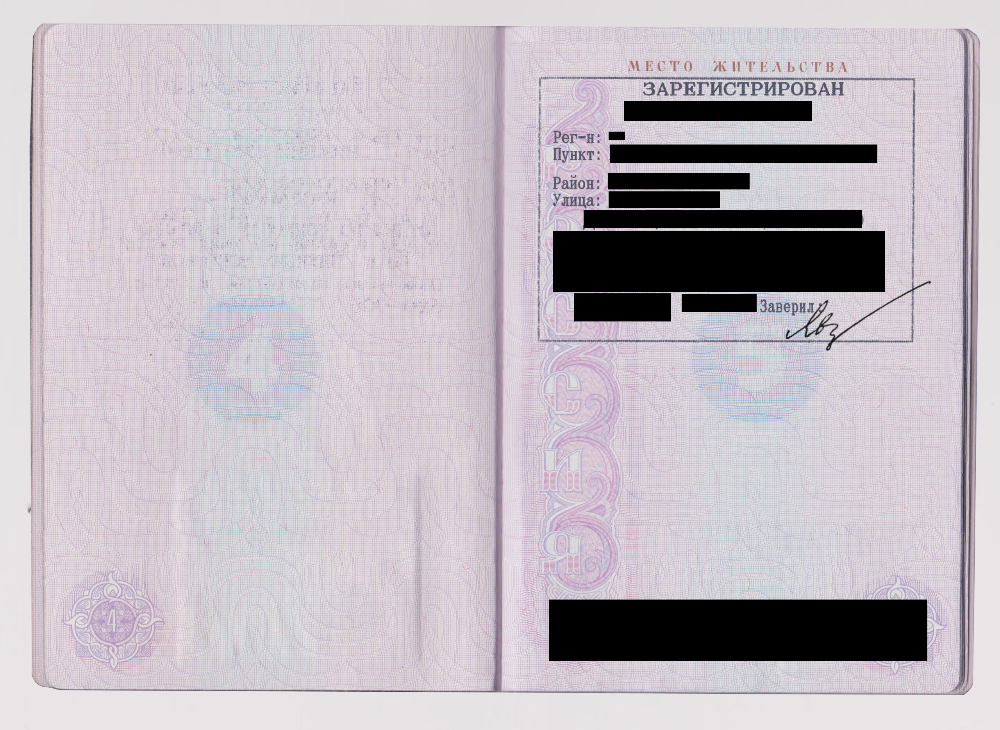

# SP documents

At the stage of sending documents, we ask you to collect a high-quality certified package of documents.


The scanned copies must be certified with: date, signature, surname with initials with the prefix "IE" or "Individual Entrepreneur" and seal \(if you have it\).



Scanned copies are accepted in .pdf format. If it's possible, please, avoid sending .jpg / .jpeg photos. We won't accept documents if they are in poor quality: blurry unreadable images, your fingers, watermarks or any extraneous inscriptions will be visible on the documents, or there will be strangers/objects in the background.


Illustrative examples of documents for **individual entrepreneurs** are published below.

## **1.** Certificate of state registration of an individual as an individual entrepreneur \(OGRNIP\), which was issued before 2017

## **1.1. A record sheet on the creation of an individual entrepreneur, which is issued after 2017**


**Please, keep in mind that we need “Complete” Record Sheet, which contains the name, address, OKVED codes, etc. \(a record sheet indicating the registration of an individual as an individual entrepreneur\).   
You should not confuse such a Record Sheet with the one that simply informs that a record was made in the USRIP record about accounting with the tax authority or with the Record Sheet on making changes to USRIP \(examples below\)**


## **2.** Certificate of registration with the tax authority \(TIN\), which was issued before 2017

## **2.1.** Certificate or notification of registration with the tax authority \(TIN\), which is issued after 2017

## **3. S**P passport \(first spread + registration\)

## 4. Selfie photo of an individual entrepreneur with the main spread of the passport


Please, note that passport selfies should not contain additional captions.


## 5. Payment details

You can generate a file yourself or upload a ready-made file with details from the bank application where the current account was opened, for example:

## 6. License \(if the type of activity is subject to licensing\)

Licensing is a limitation of the administrative and legal status of a legal entity or individual entrepreneur. It is expressed in the obligation to obtain special permission from the state to conduct certain areas of business. In accordance with Article 12 of Federal Law No. 99-FZ of 04/05/2011, 57 areas of activity require a license. Each of them corresponds to its own position, approved by the Government of the Russian Federation.


You can find out if your activity is subject to licensing by following [the link](http://www.consultant.ru/document/cons_doc_LAW_113658/6a4a5b5468ba8b99831699f7d048d2a5d7710610/).


