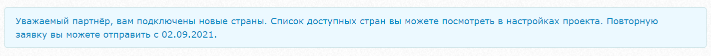
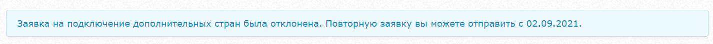

# Инструкция по интерфейсу

### **Регистрация юридических лиц \(ЮЛ\)**

Перейдите на форму регистрации [https://unitpay.ru/signup/legal  
  
](https://unitpay.ru/signup/legal)Введите ИНН и почту \(на нее придет письмо с подтверждением регистрации, может упасть в папку «Спам»\). Задайте пароль.  Согласитель с офертами и нажмите кнопку «Продолжить».

### **Подтверждение регистрации**

После этого на указанную почту придет письмо с подтверждением регистрации \(может упасть в папку «Спам»\). Перейдите по ссылке из письма для подтверждения регистрации. 

### **Добавление нового проекта и подтверждение.**

Подробную видеоинструкцию вы можете [посмотреть в документации](https://help.unitpay.ru/first_steps/adding-project).  
После подтверждения регистрации вам будет предложено добавить ваш первый проект.

Вы можете добавить сайт, ссылку на Instagram или группу в Вконтакте \(у вас должна быть роль «владелец» у данной группы\).  
  

После этого вы попадете на страницу подтверждения регистрации. 

* Для Instagram и Вконтакте потребуется предоставить доступ к вашей странице для подтверждения. 
* Подтвердить владение сайтов вы можете несколькими способами на выбор: через txt-файл, мета-тег или запись TXT 

### **Модерация проекта**

После подтверждения ваш проект попадет на первичную проверку в службу поддержки Unitpay. Среднее время проверки занимает 10 минут. [Подробней про модерацию.](https://help.unitpay.ru/first_steps/moderation)

Как только будет пройдена модерация вы получите уведомление в личном кабинете Unitpay, а также письмо на почту.

### Настройка проекта и прием платежей

После модерации вы можете подключить прием платежей на своем ресурсе. В Unitpay это можно сделать несколькими способами:

* [С помощью готовых модулей для популярных cms/saas-систем ](https://help.unitpay.ru/modules/cms-modules)
* [С помощью SDK ](https://help.unitpay.ru/modules/unitpay-sdk)
* [По API](https://help.unitpay.ru/payments/create-payment-easy) 
* Также вы можете [сгенерировать ссылку на оплату](https://help.unitpay.ru/payments/payment-links) в личном кабинете Unitpay в проекте в разделе «Товары» \(для включения данной функции необходимо обратиться в службу поддержки или к персональному менеджеру\).

Не забудьте указать «[Обработчик платежей](https://help.unitpay.ru/payments/payment-handler)» и ссылку, по которой необходимо будет перенаправлять пользователя в случае успешной оплаты.

### Комиссии и платежные методы

После модерации вам доступен прием денег через банковские карты, мобильную коммерцию, Samsung Pay, Apple Pay, Google Pay, Qiwi. Также вы можете подключить оплату через Paypal.

Обратите внимание, что прием средств по умолчанию открыт на определенные страны. 

### **Страны**

Если вам необходимо подключить дополнительные страны для приема платежей на проекте, сначала он должен пройти [окончательную модерацию](https://help.unitpay.ru/first_steps/moderation#okonchatelnaya-moderaciya-proekta). После этого в настройках вашего проекта появится вкладка "Страны":  

Вам необходимо выбрать, какие страны нужно подключить для приема платежей, приложить подтверждающие документы и отправить заявку. 


Заявку на подключение дополнительных стран можно отправлять **1 раз в месяц**, поэтому рекомендуем к заявке сразу прикладывать документы, подтверждающие трафик. Это значительно увеличивает вероятность их подключения.


После отправления заявки вы получите уведомление:

Если вы отправили корректные подтверждающие документы, то заявка будет одобрена и статус во вкладке "Страны" изменится:

Если же необходимые подтверждения трафика не были приложены к заявке, то заявка, скорее всего, будет отклонена, а статус во вкладке "Страны" изменится:

### Выплаты

Для открытия выплат вам необходимо перейти на вкладку «Выплаты» и нажать кнопку «Согласиться и продолжить» \(обратите внимание, что у вас должен быть создан хотя бы 1 проект, иначе функционал выплат не откроется\). 

Далее вы попадете на страницу с заполнением данных для формирования анкет \(их нужно будет скачать и приложить на следующем этапе\). 

На следующей вкладке "Документы" вам необходимо отправить учредительные документы для заключения договора. Вам нужно выбрать необходимые заверенные сканы документов и приложить их к форме **\(сканы не нужно заверять у нотариуса, достаточно вашей подписи и печати, если она есть\)**.

Данные документы и Анкеты мы отправляем на согласование нашим вендорам, которые создают индивидуальные лицевые счета у себя в системе, с которых будут происходить выплаты.

Выплаты происходят автоматически на следующий банковский день.

### Онлайн-кассы и «Юнит.Чеки»

После отправки документов и согласования проекта вам откроется функционал подключения онлайн-касс. Перейдите во вкладку «Управление» → «Онлайн-кассы»

С подробным руководством по включению Юнит.Чеков можно ознакомиться [здесь](https://help.unitpay.ru/online-cash-register/unit.receipts).

Если у вас уже есть своя онлайн-касса, то вы можете подключить ее в интерфейсе Unitpay. Система поддерживает интеграцию с Атол.Онлайн, МодульКассой, E-COM кассой и Kit.Online.  
  
Подробнее о подключении и формировании чеков вы можете [прочитать в документации.](https://help.unitpay.ru/online-cash-register)

### Отчетные документы

Ежемесячные закрывающие документы формируются на 5-й рабочий день месяца по производственному календарю. Вы можете скачать их в разделе «Управление» -&gt; «Отчетность».  
  
Дополнительно вы можете подключить отправку документов через «Контур.Диадок».  

Помимо ежемесячных реестров,  по части операций формируются ежедневные реестры за прошлый день. Реестры приходят на почту, на которую зарегистрирован аккаунт, а также вы можете их скачать в личном кабинете.

Сформировать и скачать архив с реестрами можно, задав временной период \(максимум - 31 день\), дефолтным значением служит период в 31 день до сегодняшней даты включительно. Данные операции не будут учитываться в ежемесячных Отчетах.

### Роли и сотрудники

Вы можете добавить новых сотрудников через вкладку «Управление» → «Сотрудники» и настроить доступы к проектам.

Доступные варианты ролей:

* Администратор \(ваш аккаунт\)
* Поддержка \(только просмотр статистики\)
* Партнер \(обладает теми же правами, что доступны и Вам\)
* Программист \(просмотр статистики и управление настройками проекта\)
* Менеджер \(просмотр статистики и выплат\)
* Бухгалтер \(просмотр статистики и выплата средств\)


При добавлении новых сотрудников на аккаунте рекомендуем использовать вход по одноразовому паролю через SMS. Двухфакторная аутентификация позволяет эффективно обезопасить ваш аккаунт от несанкционированного входа, тем самым защитить персональные данные - доступ к истории транзакций, настройкам проектов и финансовой информации.  
Особенно рекомендуется при добавлении сотрудников с ролью "Бухгалтер" и "Партнер".


